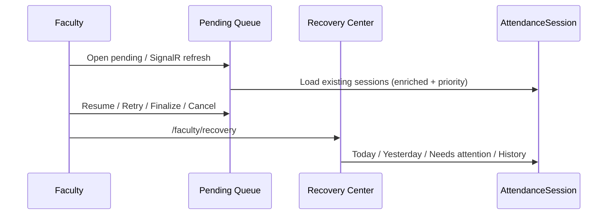
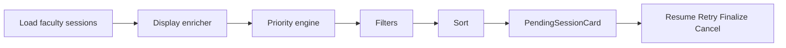

# AI22.8.5 — Enterprise Attendance Operations

## Architecture Review

AI22.8.5 extends AI22.8 recovery without changing:

- `AttendanceSessionResolver` (sole Legacy vs Timetable decision point)
- Attendance APIs / controllers
- Recognition engine / AI22 review engine
- Timetable / scheduling engines

Both modes remain supported:

```text
Legacy: Faculty → Course → Group → Semester → Subject → Period → Attendance
Timetable: Faculty → Today's Timetable → Attendance
```

Recovery always resumes the **existing** `AttendanceSession`.

## Recovery Flow



## Queue Flow



## Priority Engine

Order (highest first):

1. Failed  
2. Needs Review  
3. Recognition Ready  
4. Recognition Running  
5. Expired Soon  
6. Recently Started  

Each card exposes: **Priority Score**, **Age**, **Retry Count**, **Failure Count**, **Expected Remaining Time**.

## Dashboard Guide (Admin)

Path: `/setup/attendance-recovery`

Widgets: Sessions by Status, Longest Running, Faculty Productivity, Average Review Time, Recognition Failure Rate, Retry Success Rate, Finalization SLA, Department Distribution, Course/Room Distribution, Top Busy Faculty, Health alerts, Operational analytics (read-only), Excel export.

## Faculty Guide

- Pending tab: enterprise queue with filters/sort + `PendingSessionCard`
- Recovery center: `/faculty/recovery`
- Workspace home: summary chips + quick Resume / Retry / Finalize / History
- Preferences: `AttendanceRecoveryPreference` (auto-save, resume confirmation, landing page, notifications, timeout warning)

## Administrator Guide

- Operations + analytics endpoints under `api/admin/attendance-recovery/*`
- Health monitor publishes **admin-only** SignalR `AttendanceHealthAlert`
- **Never auto-cancels** sessions

## ADL Mapping

| Capability | Component |
|------------|-----------|
| Queue | `IPendingSessionQueueService` |
| Priority | `AttendanceSessionPriorityEngine` |
| Preferences | `AttendanceRecoveryPreference` |
| Faculty center | `IFacultyRecoveryCenterService` |
| Ops dashboard | `IAttendanceOperationsDashboardService` |
| Analytics | `IAttendanceOperationalAnalyticsService` |
| Health | `IAttendanceHealthMonitorService` + hosted worker |
| UI card | `PendingSessionCard` |
| Workspace | `FacultyWorkspaceRecoverySummary` |

## Migration Guide

```powershell
dotnet ef database update --project Abhyanvaya.Infrastructure --startup-project Abhyanvaya.API
```

Migration: `20260803180000_AI22_8_5_AttendanceRecoveryPreference` creates `AttendanceRecoveryPreference`.
