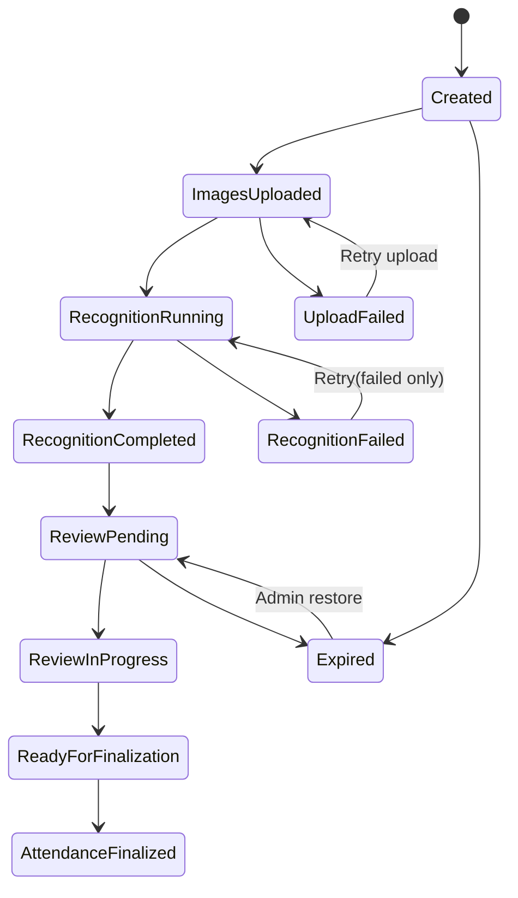

# AI22.8 — Enterprise Attendance Lifecycle

## Additive workflow status

`AttendanceWorkflowStatus` is **additive**. It does **not** replace `AttendanceSessionStatus`.

| WorkflowStatus | Typical Status |
|----------------|----------------|
| Created | Draft / Pending |
| ImagesUploaded | Draft / Pending with images |
| RecognitionRunning | Processing |
| ReviewPending / ReviewInProgress | AwaitingReview |
| ReadyForFinalization / RecognitionCompleted | AwaitingReview (ready) |
| AttendanceFinalized | Approved / Completed |
| RecognitionFailed / UploadFailed | Failed |
| Cancelled | Cancelled |
| Expired | any non-terminal + `WorkflowExpiredUtc` |

## Diagram

## Status sync points

| Transition | Owner |
|------------|--------|
| RecognitionRunning / Failed / ReviewPending | `AttendanceSessionManager` |
| ReviewPending / RecognitionFailed (classroom photos) | `ClassroomRecognitionPipeline` |
| AttendanceFinalized (+ expire guard) | `AttendanceSessionFinalizer` |
| ReviewInProgress (checkpoint) | `AttendanceResumeService.SaveCheckpointAsync` |
| Expired / restore | `AttendanceExpirationService` / admin actions |

## Compatibility

- Timetable vs Legacy selection remains solely in `AttendanceSessionResolver`.
- Attendance session/recognition/finalize APIs are unchanged.
