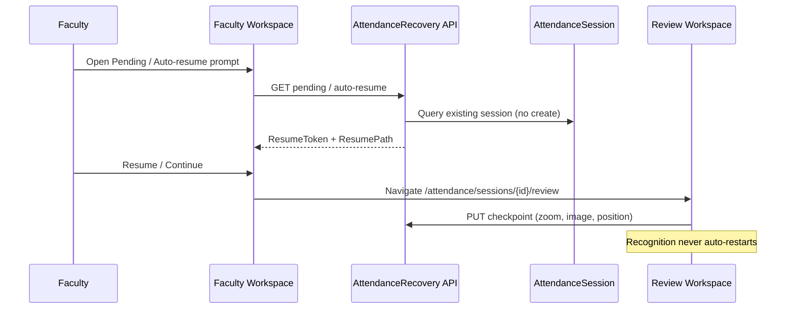
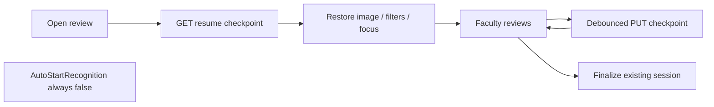
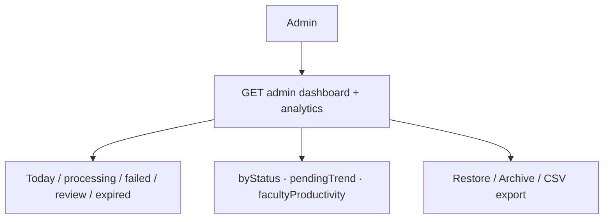

# AI22.8 Recovery Flow

```mermaid
sequenceDiagram
  participant F as Faculty
  participant UI as Faculty Workspace
  participant API as AttendanceRecovery API
  participant S as AttendanceSession
  participant R as Review Workspace
  F->>UI: Open Pending / Auto-resume prompt
  UI->>API: GET pending / auto-resume
  API->>S: Query existing session (no create)
  API-->>UI: ResumeToken + ResumePath
  F->>UI: Resume / Continue
  UI->>R: Navigate /attendance/sessions/{id}/review
  R->>API: PUT checkpoint (zoom, image, position)
  Note over R: Recognition never auto-restarts
```

## Resume checkpoint

```mermaid
flowchart LR
  A[Open review] --> B[GET resume checkpoint]
  B --> C[Restore image / filters / focus]
  C --> D[Faculty reviews]
  D --> E[Debounced PUT checkpoint]
  E --> D
  D --> F[Finalize existing session]
  Note1[AutoStartRecognition always false]
```

## Admin dashboard

```mermaid
flowchart TB
  Admin --> Dash[GET admin dashboard + analytics]
  Dash --> Counts[Today / processing / failed / review / expired]
  Dash --> Charts[byStatus · pendingTrend · facultyProductivity]
  Dash --> Actions[Restore / Archive / CSV export]
```
