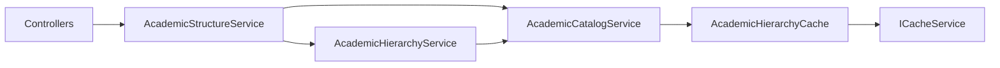

# AI29.1A.5 — Architecture Review

## Verdict

**Compliant** enterprise hardening of AI29.1A. Focus is service boundaries, cache, DisplayOrder, versioning, events, and policy configuration — not operational lifecycle on Program.

## Checklist

| Principle | Result |
|-----------|--------|
| Clean Architecture | Domain → Application services → API controllers |
| DDD | Program aggregate events; AOU as bounded concept (ADR-022) |
| CQRS (light) | Catalog writes vs hierarchy reads |
| Repository / DbContext | Via `IApplicationDbContext` |
| Caching | `IAcademicHierarchyCache` over `ICacheService` |
| Domain Events | Program*/Course* with logging handlers |
| SOLID | Facade delegates; no duplicated hierarchy logic |
| Tenant Isolation | All queries filter `TenantId` |
| Attendance unchanged | Resolver/APIs not modified |
| Scheduling unchanged | Engines not modified |
| Dashboard UI unchanged | Prep APIs only |
| Subject Master APIs unchanged | Additive `DisplayOrder` column only |

## Service split

## Lifecycle note

Rich operational states belong to Academic Year, Semester Offering, Section, and Timetable — not Program master data. This keeps AI29.1B+ cleaner.

## Risks / follow-ups

- Room utilization / attendance % are read-only heuristics for dashboard prep.
- AcademicCalendarId is a nullable placeholder until calendar binding is designed.
- Future AOU generalization must remain additive.
