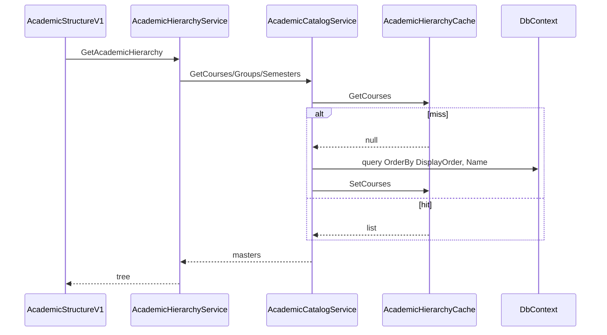

# AI29.1A.5 — Academic Hierarchy Cache Design

## Goals

- Cache Programs, Courses, Groups, Semesters for hierarchy navigation.
- Use existing `ICacheService` (Memory / Smart / Redis).
- No controller-level caching.
- Explicit invalidate / warm / refresh.

## Interface

`IAcademicHierarchyCache`

| Method | Behavior |
|--------|----------|
| `Get*/Set*` | Tenant-scoped entries |
| `InvalidateHierarchy()` | Removes all four keys |
| `WarmCache()` | Loads from DB and fills cache |
| `RefreshCache()` | Invalidate then Warm |

## Key scheme

```
academic-hierarchy:{tenantId}:programs
academic-hierarchy:{tenantId}:courses
academic-hierarchy:{tenantId}:groups
academic-hierarchy:{tenantId}:semesters
```

TTL: 15 minutes (default).

## Sequence



## Invalidation triggers

- Program create / update / archive / delete
- Course assign / remove from Program
- EnablePrograms configuration change

## Non-goals

- Caching attendance sessions
- Caching Subject Master write APIs
- Dashboard response caching in controllers
