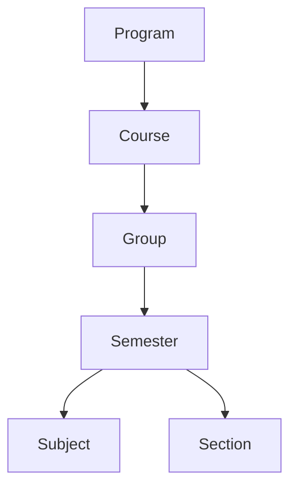

# AI29.1A.5 — Academic Hierarchy Enterprise Hardening

## Summary

Extends AI29.1A with enterprise architecture capabilities while preserving attendance, scheduling, subject master, and dashboard UI contracts.

## Chief Architect refinement (applied)

| Topic | Decision |
|-------|----------|
| Program lifecycle | Keep **Active / Inactive / Archived** |
| Planning/Open/Operational/Closed | Deferred to Academic Year / Semester Offering / Section / Timetable |
| Icon / ThemeColor / AcademicCalendarId | Optional metadata only |
| Program rename | **Not** renamed; AOU is ADR-022 concept |

## Capabilities delivered

1. ADR-022 Academic Organizational Unit (docs)
2. `IAcademicCatalogService` + `IAcademicHierarchyService` split
3. `IAcademicHierarchyCache`
4. DisplayOrder on Program, Course, Group, Semester, Section, Subject
5. Enhanced Program statistics (read-only)
6. Program branding + AcademicCalendarId (nullable)
7. `ProgramPolicy` configuration (no enforcement)
8. Dashboard-ready hierarchy APIs
9. `/api/v1/academic-structure` versioning
10. Domain events (logging handlers, no SignalR)

## Hierarchy (Programs enabled)



## Attendance compatibility (unchanged)

```
Course → Group → Semester → Subject → Period → Attendance
```

`AttendanceSessionResolver` must not change.

## API surface

| Route | Notes |
|-------|-------|
| `/api/programs` | Retained + extended dashboard prep |
| `/api/academic-structure` | Retained |
| `/api/v1/academic-structure` | Versioned enterprise surface |

## Migration

`scripts/Apply_AI29_1A5_EnterpriseHardening.sql` — additive only.
