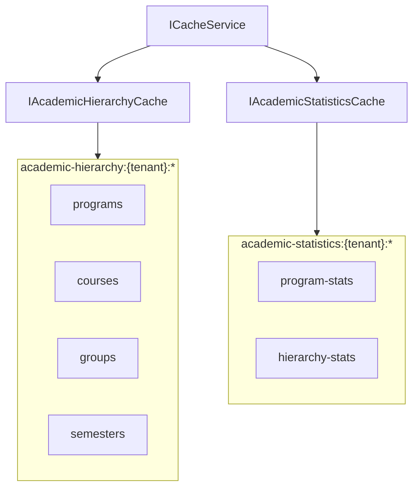
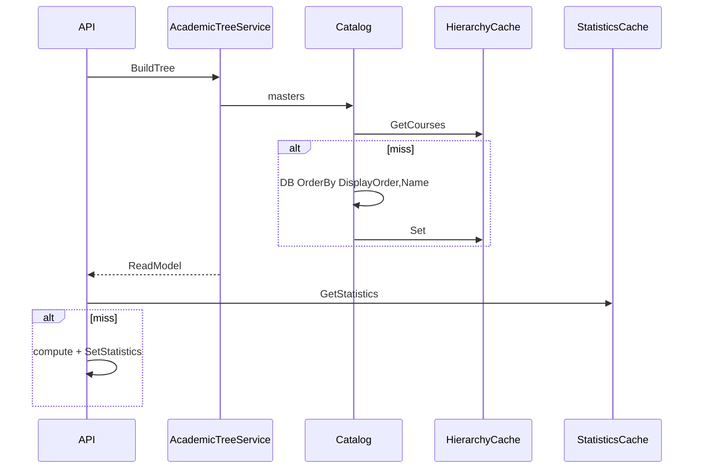

# AI29.1A.6 — Performance

## Targets

| Metric | Target |
|--------|--------|
| Hierarchy tree from cache | &lt; 50 ms |
| Cached statistics retrieval | &lt; 30 ms |
| Cold hierarchy build (typical college) | &lt; 500 ms |
| Attendance / Scheduling latency | No increase |

## Cache separation

Hierarchy changes rarely; statistics change frequently. **Never share cache keys.**

## Cold vs warm

## Snapshots

`AcademicHierarchy:EnableDailySnapshots` defaults to **false**. No daily job runs unless enabled.
