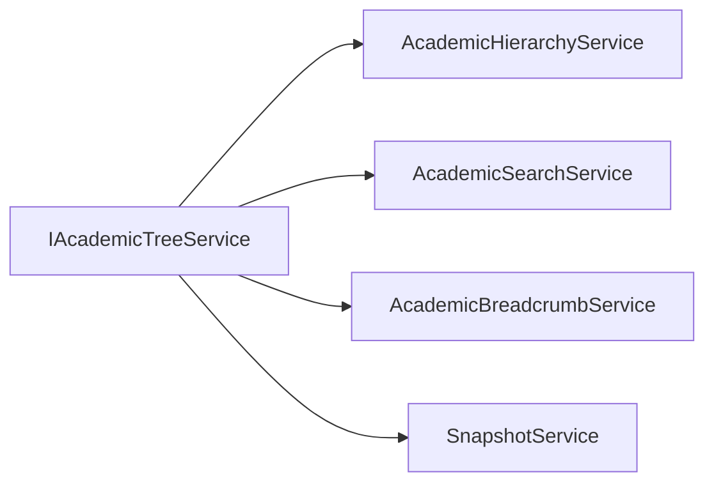

# AI29.1A.6 — Academic Tree Service

## Role

`IAcademicTreeService` is the **only** tree builder.

Dashboard, Catalog, Wizard, and Student modules must reuse it — not rebuild entity graphs.

## Methods

| Method | Behavior |
|--------|----------|
| BuildTree | Builds immutable read model from catalog |
| FlattenTree | Depth-first flat list |
| GetChildren / GetParent / GetPath | Navigation |
| Expand / Collapse | Expanded-node set helpers (model stays immutable) |

## Consumers

## Attendance compatibility

Manual path remains Course → Group → Semester → Subject → Period → Attendance. Tree service never requires Program.
