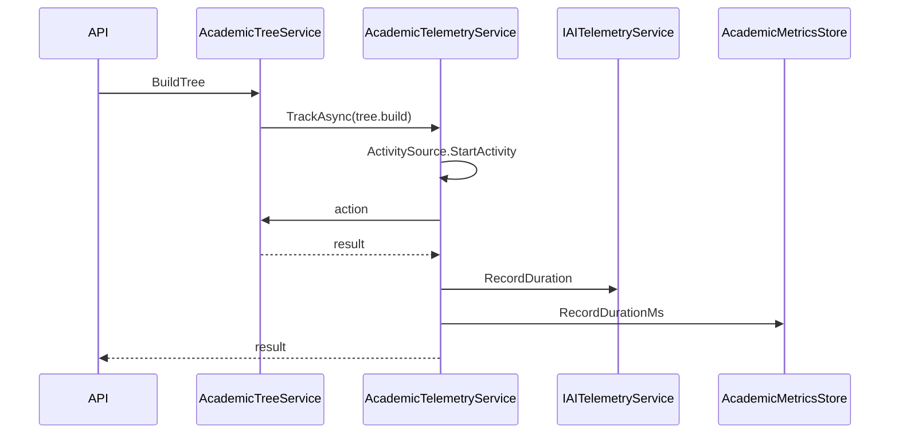

# AI29.1A.7 — Academic Platform Observability

## Scope

Observability only. No attendance, scheduling, subject master, or dashboard business changes.

## Reused platform infrastructure

| Platform | Academic usage |
|----------|----------------|
| `IAITelemetryService` | Duration recording |
| `IAITracingService` | Span context |
| `IAIMetricsCollector` | Counter increments |
| `ActivitySource("Abhyanvaya.Academic")` | Vendor-neutral OTel/DataDog spans |
| `ILogger` | Structured logs |
| BackgroundService | Async architecture trend capture |

## Feature flags (`AcademicPlatform`)

```json
{
  "EnableTelemetry": true,
  "EnablePerformanceMetrics": true,
  "EnableArchitectureMetrics": true,
  "EnableSnapshots": false
}
```

## Telemetry flow



## APIs

| Method | Route |
|--------|-------|
| GET | `/api/v1/academic-platform/metrics` |
| GET | `/api/v1/academic-platform/health` |
| GET | `/api/v1/academic-platform/performance` |
| GET | `/api/v1/academic-platform/architecture/trends` |
| POST | `/api/v1/academic-platform/architecture/trends/capture` |
