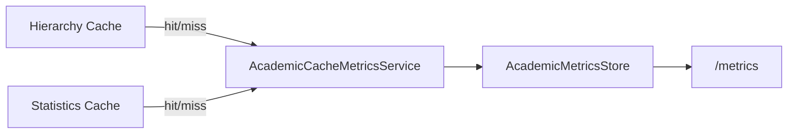

# AI29.1A.7 — Performance Budgets

| Component | Target |
|-----------|--------|
| Hierarchy Cache | &lt; 50 ms |
| Statistics Cache | &lt; 30 ms |
| Tree Build | &lt; 100 ms |
| Search | &lt; 40 ms |
| Breadcrumb | &lt; 20 ms |
| Academic Structure API | &lt; 150 ms |

Budgets are encoded in `AcademicPerformanceBudgets` and reported via `IAcademicPerformanceMonitor`.

Empty sample sets are treated as within budget (no false Critical on cold start).

## Cache flow

