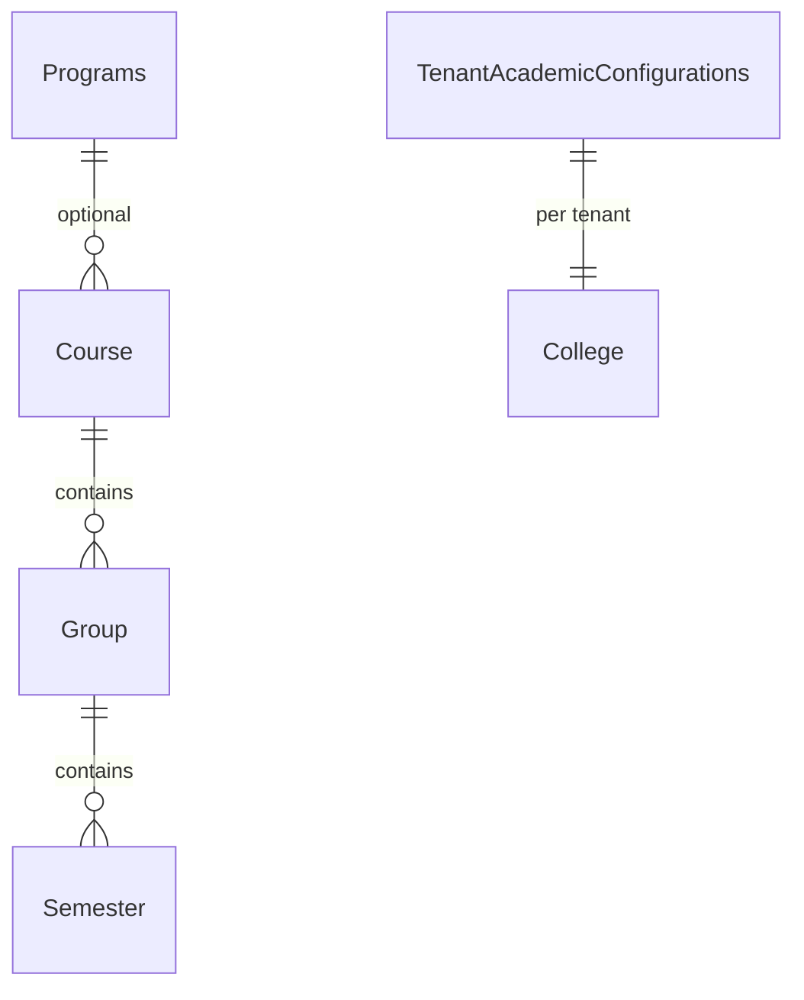

# AI29.1A — Database Design

## New tables

| Table | Purpose |
|-------|---------|
| `Programs` | Program master |
| `TenantAcademicConfigurations` | `EnablePrograms` per tenant |

## Additive column

| Table | Column | Notes |
|-------|--------|-------|
| `Course` | `ProgramId` int NULL | Existing rows remain valid |

## Migration

`scripts/Apply_AI29_1A_ProgramSchema.sql` — idempotent, non-destructive.

