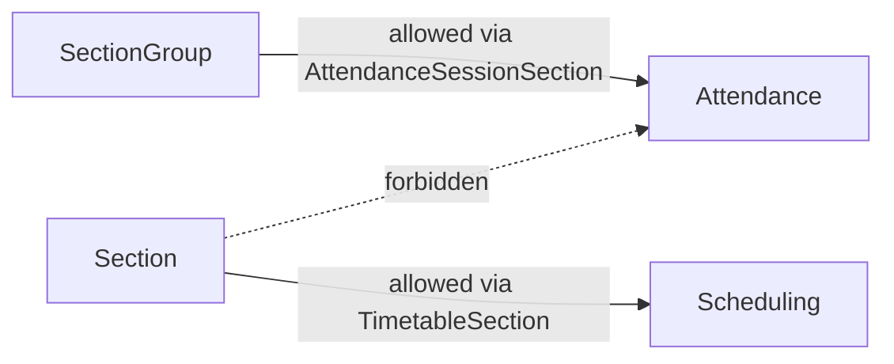
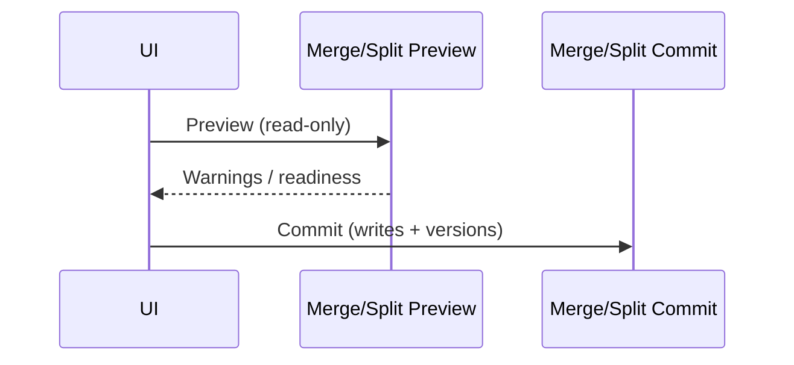
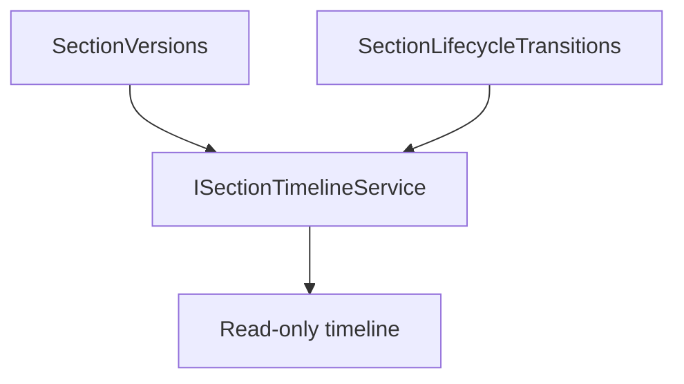

# AI29.1B.5 — Architecture Review

## Boundaries

## Preview / commit separation

## Timeline flow

## Verification

- Preview services have no write / lifecycle commit dependencies (guard-enforced)
- Versioning isolated from capacity formula engine (capacity still sole calculator)
- Policies independent of AI29.1C allocation
- Tenant isolation on all new tables
- Observability reuses AI29.1A.7 telemetry
