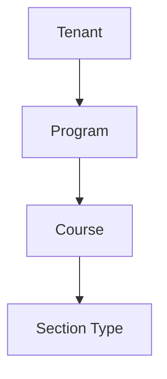

# AI29.1B.5 — Section Policy Framework

## Hierarchy

Closest (most specific) scope overrides higher levels. Configuration + validation/warnings only — no automatic enforcement actions.

Fields: Max/Min/Recommended Capacity, Max Combined Sections, Max Faculty, Max Room Occupancy, Allow Merge/Split.
