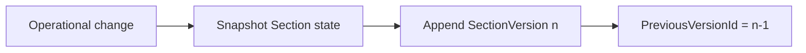

# AI29.1B.5 — Section Versioning

## Immutability

`SectionVersion` is append-only. Never update or delete a version row for business corrections — record a new version.

## Operations

Create · Update · Merge · Split · CapacityChange · LifecycleChange

## Version lifecycle

Hooks: create/update, lifecycle transition, capacity update, merge commit, split commit.
