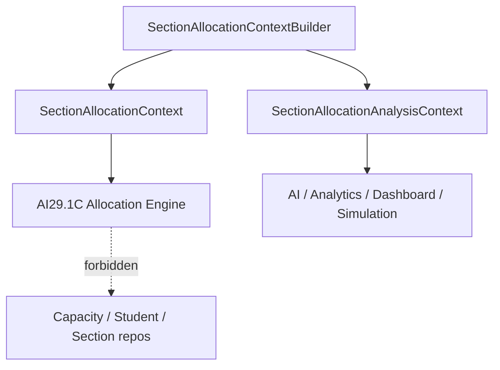

# AI29.1B.7 — Allocation Context

## Purpose

`SectionAllocationContext` is the **only** input model AI29.1C Allocation Engine may consume.

It is immutable (init-only properties), versioned, and checksummed so allocation decisions can be reproduced.

## Versioning

| Field | Meaning |
|-------|---------|
| `ContextId` | Unique id per build |
| `ContextVersion` | Logical context revision |
| `SchemaVersion` | Contract schema (`1.0.0`) |
| `GeneratedAt` | UTC generation time |
| `Checksum` | SHA-256 over hierarchy/sections/capacity/counts |

## Contents

- Hierarchy (Academic Year → Program → Course → Group → Semester)
- Sections (type, lifecycle, health, readiness)
- Capacity (max/min/recommended, strength, available, reserved, waiting list)
- Students / Faculty / Subjects / Rooms
- Policies, Recommendations, Metadata
- Overall Health / Readiness / TimetableStatus

## Analysis context

`SectionAllocationAnalysisContext` wraps the execution context with history/trends/forecast for AI, analytics, dashboard, and simulation. **Never** used by allocation execution.

