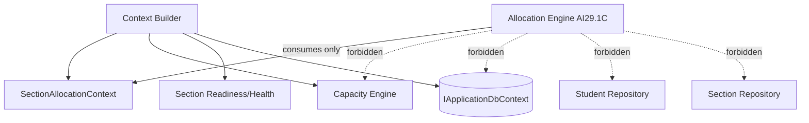

# AI29.1B.7 — Architecture

## Dependency rule (frozen for AI29.1C)

## Clean Architecture

| Layer | AI29.1B.7 artifacts |
|-------|---------------------|
| Domain | `SectionAllocationSnapshot`, lifecycle/type constants (reuse) |
| Application | Context, projections, builder, readiness, validator, health, cache, NoOp strategies |
| Infrastructure | EF mapping + migration `20260808180000_AI29_1B_7_AllocationPlatform` |
| API / UI | `/api/allocation/*`, `/setup/academic/allocation-context` |

## Cache

`IAllocationContextCache` keys: `allocation-context:{tenant}:{year}:{course}:{group}:{semester}`

Separate from Hierarchy Cache and Statistics Cache. Reuses platform `ICacheService`. Metrics: hit/miss/warm/refresh via AI29.1A.7.

## Extension contracts (NoOp)

- `IAllocationStrategy`
- `IAllocationConstraint`
- `IAllocationScoringProvider`
- `IAllocationRecommendationProvider`
- `AllocationConstraintRegistry` (descriptive only)

AI29.1C replaces NoOps with real algorithms; it must not revisit context building/readiness/health.

## Guard

`AcademicArchitectureGuard.ValidateAllocationBoundaries()` → `AllocationArchitectureReport`.

## Compatibility

AttendanceSessionResolver, Attendance APIs, Subject Master, Scheduling/Timetable engines, AI31 dashboard business logic, Faculty Workspace — **unchanged**.
