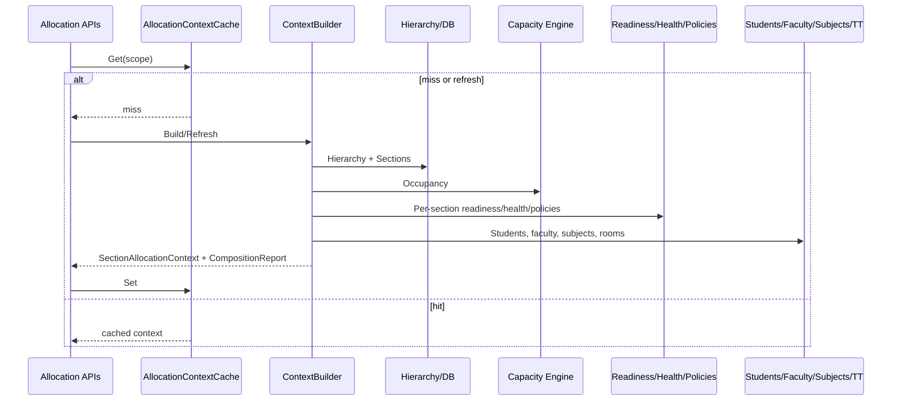

# AI29.1B.7 — Context Builder

## Interface

`ISectionAllocationContextBuilder`

- `BuildAsync` / `RefreshAsync`
- `SnapshotAsync`
- `ValidateAsync`
- `BuildAnalysisContextAsync`
- `GetLastCompositionReportAsync`

## Composition sequence

## Isolation rule

Allocation Engine must **never** call hierarchy/capacity/student/section services directly. Only the Builder composes those sources into an immutable context.

## Composition report

Each build records service step timings, outcomes, warnings, and total duration for debugging and performance tuning.
