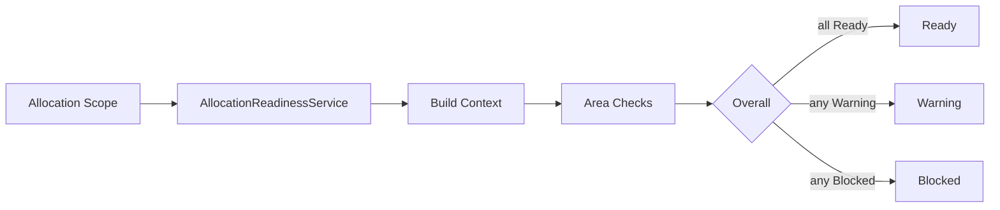

# AI29.1B.7 — Allocation Readiness & Health

## Readiness (`IAllocationReadinessService`)

Read-only evaluation returning **Ready / Warning / Blocked** for:

- Academic Year, Hierarchy, Sections, Capacity, Policies
- Faculty, Subjects, Students, Rooms, Timetable, Lifecycle

## Validation (`ISectionAllocationContextValidator`)

Produces `AllocationValidationReport` (errors/warnings/checks). No writes.

## Health (`IAllocationHealthService`)

Aggregates Context + Readiness + Validation + Capacity/Students into **Healthy / Warning / Critical**.
