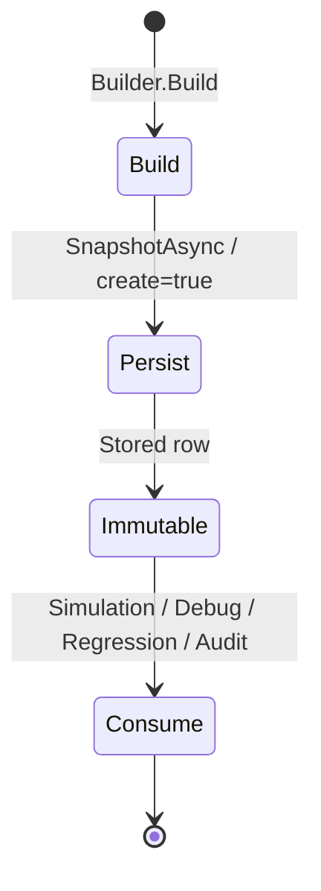

# AI29.1B.7 — Allocation Snapshots

## Entity

`SectionAllocationSnapshot` (immutable after insert)

| Field | Purpose |
|-------|---------|
| SnapshotId | Public id |
| ContextVersion / SchemaVersion | Versioning |
| Checksum | Integrity |
| GeneratedDate / GeneratedBy | Audit |
| Scope ids | AcademicYear/Course/Group/Semester |
| ContextJson | Serialized `SectionAllocationContext` |

## Lifecycle

Snapshots are never mutated. Used for simulation, debugging, regression, and audit — not for live student assignment.
