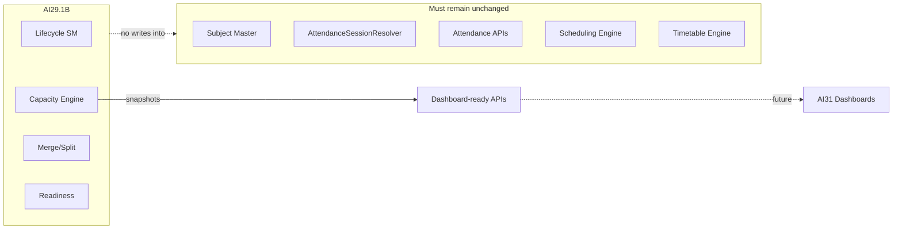

# AI29.1B — Architecture Review

## Clean Architecture

| Layer | Responsibility |
|-------|----------------|
| Domain | Lifecycle states/types/SM, entities (Section, SectionGroup, transactions, lineage, policy) |
| Application | Capacity engine, lifecycle/merge/split/readiness/group/report services, DTOs, 1C allocation contracts |
| Infrastructure | EF mappings, SQL migration, permission seed |
| API / UI | Controllers + Catalog-style Sections tabs |

## Boundaries respected

- **DDD**: Section remains operational (not curriculum Subject). SectionGroup is first-class aggregate.
- **CQRS-ish**: Capacity/readiness/report reads vs lifecycle/merge/split writes.
- **Repository**: EF via `IApplicationDbContext` (project pattern).
- **SOLID**: Single capacity calculator; lifecycle SM for transitions; readiness does not mutate.
- **Tenant isolation**: All queries filter `TenantId`.

## Compatibility validation

## Verification checklist

- [x] Lifecycle transitions centralized
- [x] Capacity formulas not duplicated in controllers/UI
- [x] SectionGroup first-class
- [x] Merge/Split reversible with lineage
- [x] Readiness advisory only
- [x] Dashboard APIs only (AI31 not modified)
- [x] AI29.1C allocation interfaces introduced
- [x] Attendance / Scheduling / Subject Master untouched by design

## Risks / follow-ups

1. PDF export is a lightweight text stand-in until a PDF package is adopted.
2. Split commit creates children but defers student reallocation to AI29.1C.
3. Existing tenants apply via EF (`MigrateAsync` / `dotnet ef database update`) and re-login for new JWT permissions. Use `MarkApplied_AI29_1B_*.sql` only if schema already exists outside EF.
