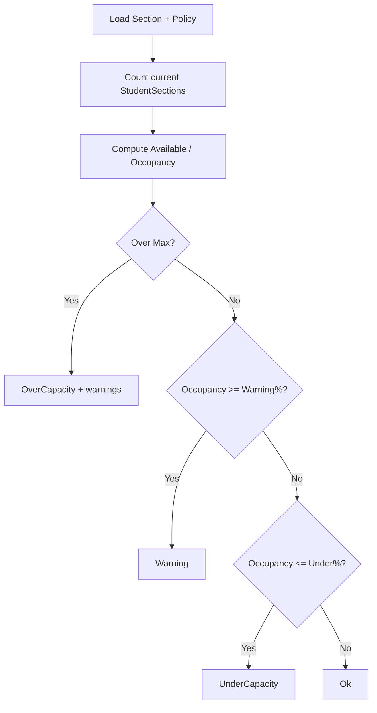

# AI29.1B — Capacity Engine

## Principle

`ISectionCapacityEngine` is the **only** component that computes occupancy. Controllers, UI, reports, and readiness consume its snapshots.

## Fields

| Field | Source |
|-------|--------|
| Maximum Capacity | `Section.MaximumStrength` (AI29-compatible) |
| Minimum Capacity | `Section.MinimumCapacity` |
| Recommended Capacity | `Section.RecommendedCapacity` |
| Current Strength | count of current `StudentSections` |
| Reserved Seats | `Section.ReservedSeats` |
| Waiting List | `Section.WaitingListCount` |
| Available Seats | max(0, Max − Current − Reserved) |
| Occupancy % | Current / Max × 100 |

## Rules (warnings only)

Tenant policy (`TenantSectionCapacityPolicy`):

- Hard Limit — blocks new assignments when enforced
- Soft Limit — over-capacity produces warnings
- Warning % / Auto Warning
- Under Capacity %

**No automatic student movement.**

## Calculation flow

## Dashboard-ready APIs

- `GetCapacitySummary`
- `GetSectionOccupancy`
- `GetOverCapacity` / `GetUnderCapacity`
- `GetAnalytics`
- `GetSectionHealth` (via readiness)

Permission: `Section.Capacity`
