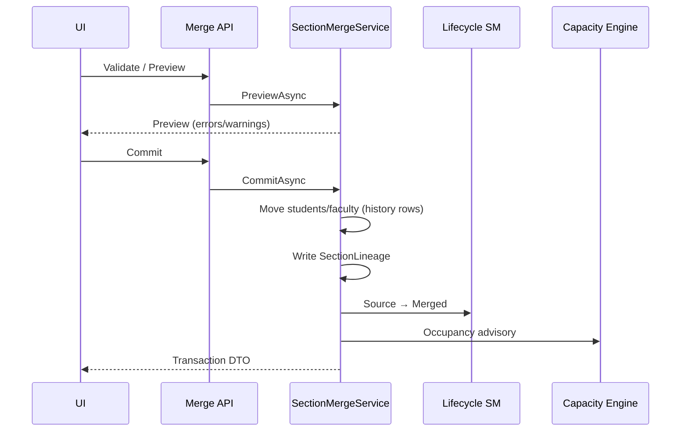
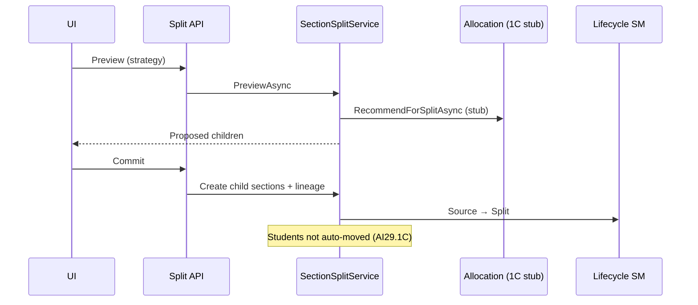

# AI29.1B — Merge & Split

## Design refinements

- **Reversible**: sections are never physically deleted during merge/split.
- **Lineage**: `SectionLineage` + `ParentSectionId` + merge/split transactions with effective dates.
- **Allocation**: AI29.1C strategies are extension points only (`ISectionAllocationRecommendationService`).

## Merge sequence

## Split sequence

## Combined sections (`SectionGroup`)

First-class aggregate with membership history (`SectionGroupMember`). One timetable entry / one attendance session may map to multiple sections via existing `TimetableSections` — no duplicate schedules.

## Permissions

`Section.Merge`, `Section.Split`
