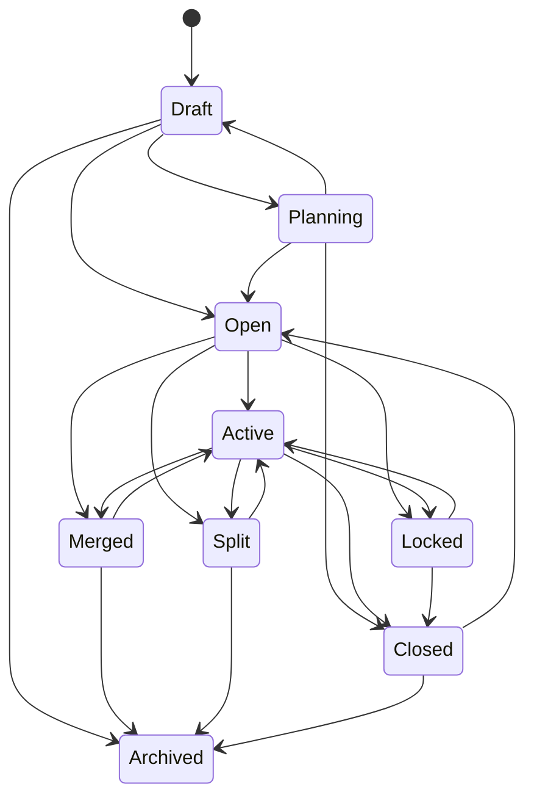

# AI29.1B — Enterprise Section Lifecycle

## Purpose

Centralize section status changes through a validated state machine (`SectionLifecycleStateMachine` + `ISectionLifecycleService`). Callers must not assign `Section.Status` ad hoc.

## States

Draft → Planning → Open → Active → Locked → Merged | Split → Closed → Archived

Legacy AI29 values: `Inactive` → Closed, `Unassigned` → Draft.

## State diagram

## Types

Configurable string codes (`SectionTypeCodes`): Regular, Honours, Bridge, Tutorial, Practical, Laboratory, Remedial, Weekend, Evening, SpecialBatch. Business logic must not switch on enums.

## APIs

- `GET /api/sections/lifecycle/states`
- `GET /api/sections/lifecycle/types`
- `POST /api/sections/lifecycle/{id}/transition`
- `GET /api/sections/lifecycle/{id}/history`

## Permissions

`SectionLifecycle.View`, `SectionLifecycle.Edit`
