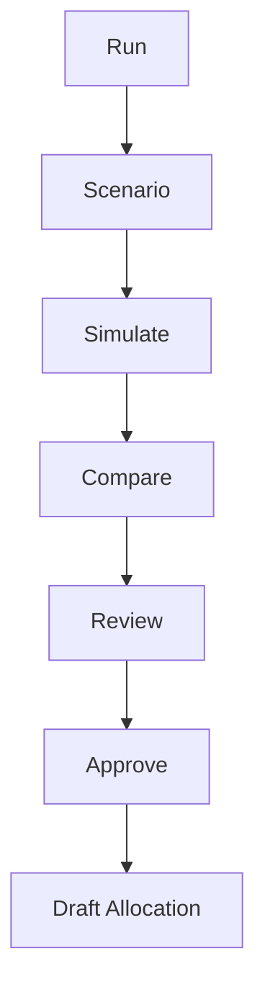

# AI29.1C.5 — Allocation Operations

```mermaid
flowchart TD
  Run[Run] --> Scenario[Scenario]
  Scenario --> Simulate[Simulate]
  Simulate --> Compare[Compare]
  Compare --> Review[Review]
  Review --> Approve[Approve]
  Approve --> Draft[Draft Allocation]
```

Workspace: `/setup/academic/allocation/operations`

APIs: `GET /api/allocation/operations`, scenarios, analytics, audit, replay, compare, governed approve.
