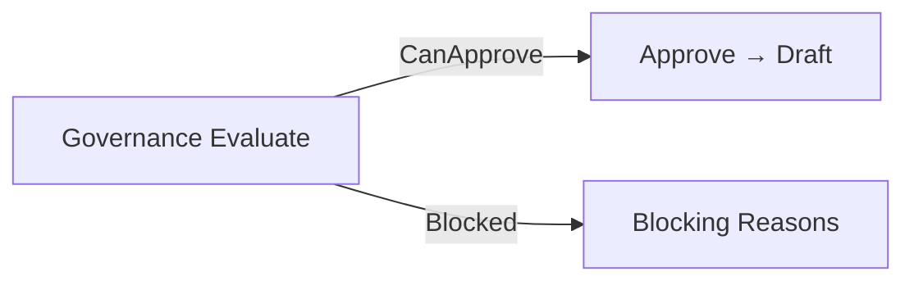

# AI29.1C.5 — Scenario Governance

Approval blocked when:

- mandatory constraints unresolved
- context stale (checksum mismatch vs current context)
- checksum invalid
- scenario archived
- scenario already approved
- version invalid

Never updates live `StudentSection` rows.
