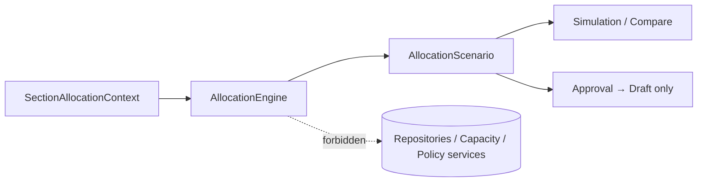

# AI29.1C — Allocation Engine

## Principle

The engine consumes **only** `SectionAllocationContext` and produces an `AllocationScenario`.

It never writes live `StudentSection` rows.

## Core types

- `AllocationEngine` / `IAllocationEngine.ExecuteAsync`
- `AllocationExecutionContext` / `AllocationExecutionResult`
- `AllocationSession` (persisted as `AllocationEngineSession`)
- `AllocationScenario` with explainable student recommendations
