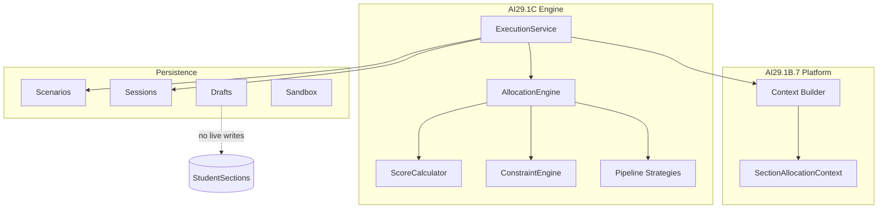

# AI29.1C — Architecture

## Guard

`AcademicArchitectureGuard.ValidateAllocationBoundaries()` rejects engine dependencies on DbContext, capacity, readiness, health, policy services, and repositories.
