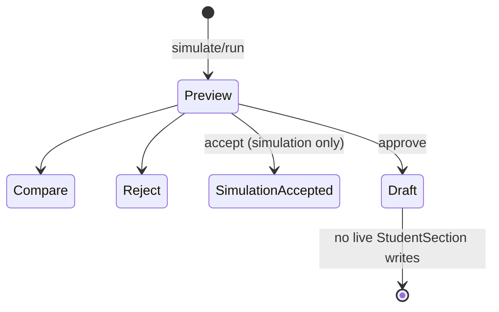

# AI29.1C — Simulation & Approval

```mermaid
stateDiagram-v2
  [*] --> Preview: simulate/run
  Preview --> Compare
  Preview --> Reject
  Preview --> SimulationAccepted: accept (simulation only)
  Preview --> Draft: approve
  Draft --> [*]: no live StudentSection writes
```

- `Preview` / `Compare` / `Reject` / `AcceptSimulation` never commit production allocations.
- `Approve` creates `AllocationEngineDraft` only.
