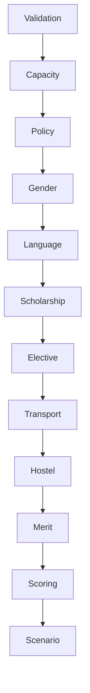

# AI29.1C — Strategies

## Pipeline (enabled via configuration)

Disabled strategies appear in the allocation trace as skipped.

## Grouping modes

StudentNumber, StudentNumberRange, LastThreeDigits, Alphabetical, Merit, Gender, Language, Scholarship, MinorSubject, Hostel, Transport, ElectiveCombination.
