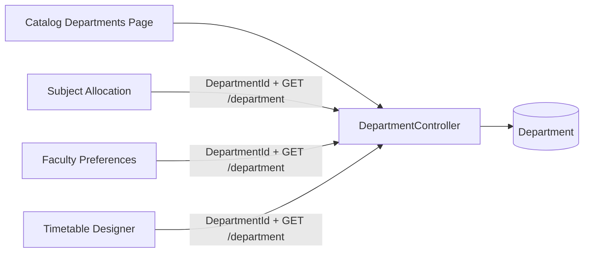

# AI30 AC1 — Single Source of Truth (Department)

## Problem

Scheduling exposed a Departments page and `api/scheduling/departments` CRUD surface that mutated the same `Department` entity already maintained under **Catalog → Departments**. That violated ADL SSOT: two masters for one concept.

## Architecture decision

**Catalog owns Department.** Scheduling consumes `DepartmentId` and Catalog APIs/DTOs. No Scheduling-owned Department master, CRUD, routes, menu, or duplicate permissions in active authorization surfaces.

## Old architecture

```text
Catalog UI ──► api/department ──► Department (table)
Scheduling UI ──► api/scheduling/departments ──► Department (same table)
```

Two UX paths, two permission pairs, one table — data drift and operator confusion.

## New architecture

```text
Catalog UI ──► api/department ──► Department (SSOT)
                                      ▲
Scheduling UIs (lookup only) ─────────┘  DepartmentId FKs
```

## Entity relationships (Scheduling → Catalog)

```text
SubjectAllocation.DepartmentId ──► Department.Id
Room.DepartmentId ──► Department.Id
Timetable.DepartmentId ──► Department.Id
TimetableEntry.DepartmentId ──► Department.Id
FacultyTeachingPreference.PreferredDepartmentId ──► Department.Id
ScheduleVersion / clone filters ──► Department.Id
```

## Dependency diagram



## Scheduling dependency map

| Scheduling feature | Department usage |
|--------------------|------------------|
| Subject Allocation | Dropdown via `listDepartments` (Catalog) |
| Faculty Preferences | Preferred department via Catalog |
| Timetable Designer / Hub | Filter & create via Catalog |
| Schedule Versions | Optional department via Catalog |
| Dashboard health | Counts Catalog departments without allocations |

## Benefits

- One CRUD surface; no dual editing
- Clear ownership for ADL / future modules
- Backward compatible FKs and table shape
- Scheduling still lists departments for operators with Scheduling permissions

## Future extensibility

- College / campus scoped department filters stay on Catalog API
- Soft-delete guard blocks Catalog delete when Scheduling references exist
- Further master-data ownership follows `AI30_MASTER_DATA_OWNERSHIP_MATRIX.md`
