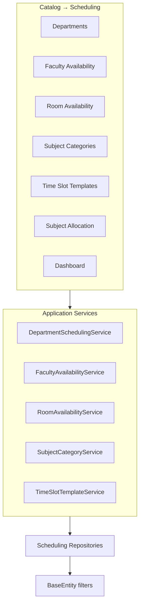

# AI30 Phase 1A — Enterprise Scheduling Foundation Enhancements

| Field | Value |
|-------|-------|
| **Document ID** | AI30-Phase1A-Scheduling-Enhancements |
| **Status** | Implemented |
| **Date** | August 2026 |
| **Scope** | Extend Scheduling bounded context only — no timetable, conflict engine, optimizer, Attendance, or AI22 recognition changes |

---

## Architecture

Phase 1A **extends** Phase 1 master data so the future Timetable Designer (Phase 2) has department context, availability calendars, subject metadata, and reusable templates.



**Preserved:** Repository + CQRS-style services, FluentValidation, TenantId, audit fields, soft delete.

**ADL references:** ADR-013 Repository Pattern; Naming Standards §11 (no MediatR CQRS); Soft delete / tenant filters (Database Overview §9, Tenant Isolation).

---

## ER / relationships

```
Department (extended: Description, IsActive)
    └── SubjectAllocation.DepartmentId (required)

Staff ──< FacultyAvailability >── AcademicYear
Room  ──< RoomAvailability  >── AcademicYear
TimeSlot (optional Start/End slot refs on availability)

SubjectCategory ──< Subject (SubjectCategoryId?, RequiresRoomType?, DefaultDurationMinutes?, RequiresLabEquipment)

TimeSlotTemplate ──< TimeSlotSet.TimeSlotTemplateId? ──< TimeSlot
```

---

## Validation rules

| Rule | Enforcement |
|------|-------------|
| SubjectAllocation.DepartmentId required | FluentValidation + service |
| Cannot soft-delete Department if referenced | DepartmentSchedulingService |
| Faculty availability no overlaps | AvailabilityOverlapHelper |
| Room availability no overlaps | AvailabilityOverlapHelper |
| Default template must contain slots | TimeSlotTemplateService.SetDefault |
| Lab category → lab room types; Theory → Classroom | SubjectCategoryValidationHelper |

---

## Permissions (seed IDs 20–27)

| Key | Purpose |
|-----|---------|
| Scheduling.Department.View / Manage | Departments |
| Scheduling.RoomAvailability.View / Manage | Room calendar |
| Scheduling.FacultyAvailability.View / Manage | Faculty calendar |
| Scheduling.Template.View / Manage | Time slot templates |

See `docs/AUTHORIZATION_MATRIX.md`.

---

## Migration

`20260801155009_AI30_Phase1A_SchedulingFoundationEnhancements`

**Note:** Existing `SubjectAllocation` rows need a valid `DepartmentId` before FK apply (column added non-nullable with default 0 in empty DBs).

---

## UI entry

**Catalog → Scheduling** — Departments, Faculty Availability, Room Availability, Subject Categories, Time Slot Templates; Subject Allocation department cascade; Dashboard health cards.

---

## Extension points (Phase 2+)

- Availability calendars feed conflict checks (Phase 3) — **not** implemented here
- Templates feed Timetable Designer period grids (Phase 2)
- Subject categories constrain room type matching (Phase 2/3)
- Department coverage metrics feed optimization (Phase 7)
