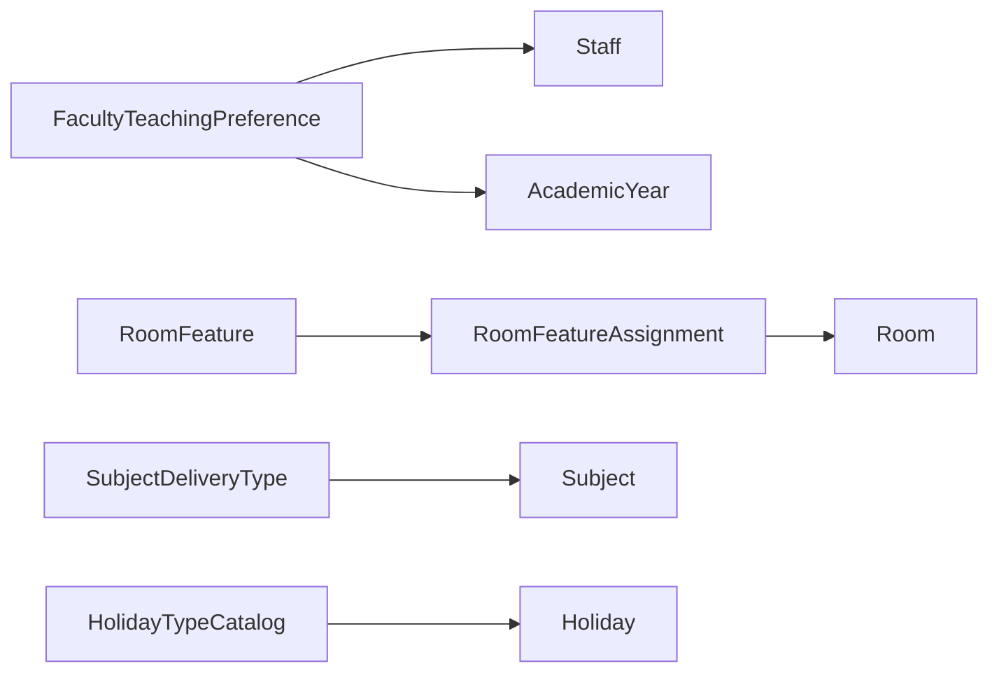

# AI30 Phase 1B — Enterprise Scheduling Foundation Extensions

| Field | Value |
|-------|-------|
| **Document ID** | AI30-Phase1B-Scheduling-Extensions |
| **Status** | Implemented |
| **Date** | August 2026 |
| **Scope** | Scheduling bounded context only |

---

## Architecture

Phase 1B adds teaching preferences, normalized room features, subject delivery types, and holiday type catalog — **metadata for Phase 2 Timetable Designer**, not generation.

**ADL:** Repository (ADR-013), CQRS-style services (no MediatR), tenant filter, soft delete, audit, FluentValidation.

## ER summary

- FacultyTeachingPreference → Staff, AcademicYear, optional campus/building/floor/room/subject/dept/course/group/semester
- RoomFeature 1─* RoomFeatureAssignment *─1 Room (Room.FeatureFlags unchanged)
- SubjectDeliveryType ← Subject.DeliveryTypeId; Subject.PreferredRoomFeatureId → RoomFeature
- HolidayTypeCatalog ← Holiday.HolidayTypeCatalogId (enum HolidayType retained)

## Validation / Permissions

See `AI30_PHASE1B_VALIDATION.md`, `AI30_PHASE1B_PERMISSIONS.md`.

## Migration

`20260801162850_AI30_Phase1B_SchedulingFoundationExtensions`

## Phase 2 integration

Preferences + features + delivery types + holiday catalog constrain designer placement; conflict engine (Phase 3) consumes availability + preferences later.

## UI

Catalog → Scheduling → Faculty Preferences | Room Features | Subject Delivery | Holiday Types | Dashboard
