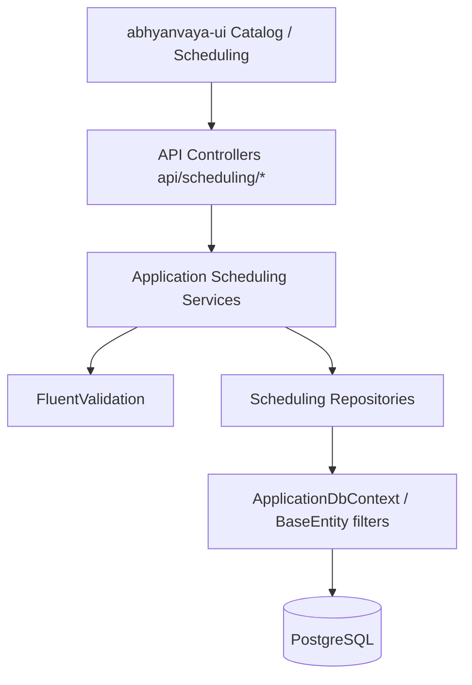

# AI30 Phase 1 — Enterprise Scheduling Foundation

| Field | Value |
|-------|-------|
| **Document ID** | AI30-Phase1-Enterprise-Scheduling |
| **Status** | Implemented |
| **Date** | August 2026 |
| **Scope** | Master data foundation only — no timetable generation, AI, optimization, or attendance automation |

---

## Architecture

AI30 is a **core enterprise platform** that will eventually power AI Attendance, Student/Faculty portals, Examinations, Classroom Management, Resource Planning, and AI Planning.

Phase 1 delivers tenant-isolated scheduling master data using Clean Architecture:



**CQRS style:** command/query methods on application services (no MediatR — ADL Naming Standards §11).  
**Repository pattern:** entity-focused interfaces (ADR-013).  
**Cross-cutting:** soft delete, tenant filter, audit stamps via `BaseEntity`.

---

## Modules (Prompts AI30.1–AI30.8)

| Prompt | Module | Entities |
|--------|--------|----------|
| AI30.1 | Academic Calendar | AcademicYear, AcademicTerm, WorkingDay, Holiday (+ HolidayType) |
| AI30.2 | Campus facilities | Campus, Building, Floor, Room (+ RoomType, Status, Features) |
| AI30.3 | Time slots | TimeSlotSet, TimeSlot (Period/Break/Lunch, sessions) |
| AI30.4 | Faculty workload | FacultyWorkload, FacultyDayPreference, FacultyTimeSlotPreference |
| AI30.5 | Subject allocation | SubjectAllocation (Subject→Faculty→Course→Group→Semester→hours) |
| AI30.6 | Room rules | RoomAllocationRule (preferences only) |
| AI30.7 | Scheduling Catalog | Catalog → Scheduling hub + pages |
| AI30.8 | Dashboard | Aggregate cards + Recharts |

---

## Database relationships (logical)

```
AcademicYear 1─* AcademicTerm
AcademicYear 1─* WorkingDay
AcademicYear 1─* Holiday
AcademicYear 1─* TimeSlotSet 1─* TimeSlot
AcademicYear 1─* SubjectAllocation
Campus 1─* Building 1─* Floor 1─* Room
Staff 1─1 FacultyWorkload 1─* Day/TimeSlot preferences
SubjectAllocation → Subject, Staff, Course, Group, Semester, Room?
RoomAllocationRule → Department?, Course?, PreferredRoom?
```

**Migration:** `20260801143654_AI30_Phase1_EnterpriseSchedulingFoundation`

---

## API list

| Area | Routes |
|------|--------|
| Academic years | `GET/POST/PUT/DELETE api/scheduling/academic-years`, `POST …/{id}/set-current`, `POST …/clone` |
| Terms | `api/scheduling/academic-terms` |
| Working days | `api/scheduling/working-days` |
| Holidays | `api/scheduling/holidays` |
| Campuses / buildings / floors / rooms | `api/scheduling/campuses|buildings|floors|rooms` |
| Time slot sets / slots | `api/scheduling/time-slot-sets|time-slots` |
| Faculty workloads | `api/scheduling/faculty-workloads` |
| Subject allocations | `api/scheduling/subject-allocations` |
| Room rules | `api/scheduling/room-rules` |
| Dashboard | `GET api/scheduling/dashboard` |

---

## Validation & business rules

- Academic year: end date ≥ start date; clone shifts calendar by year delta
- Working days: Mon–Sun flags per year
- Holidays: typed (National / University / College / Exam / Unexpected)
- Time slots: no overlapping periods in same set (+ day); no duplicate period numbers; clone set supported
- Subject allocation: unique Subject+Course+Group+Semester+AcademicYear; weekly hours required; faculty weekly hours must not exceed `MaxPeriodsPerWeek` when set
- Room rules: store preferences only — **no scheduling / conflict engine**
- Soft delete on all aggregates

---

## Permissions

| Key | Id (seed) | Policy |
|-----|-----------|--------|
| `Scheduling.View` | 18 | `CanViewScheduling` |
| `Scheduling.Manage` | 19 | `CanManageScheduling` |

Admin role seed includes permissions 1–19. UI Catalog visibility includes scheduling permissions.

---

## Future extension points

| Phase | Capability |
|-------|------------|
| Phase 2 | Timetable Designer |
| Phase 3 | Conflict Detection Engine |
| Phase 4 | Attendance Automation (uses SubjectAllocation.AiAttendanceEnabled / AttendanceMandatory) |
| Phase 5 | Faculty & Student Portals |
| Phase 6 | AI Scheduling Assistant |
| Phase 7 | Analytics & Optimization |
| Phase 8 | Platform complete |

Existing `ClassSchedule` / `api/timetable/schedules` remain for current attendance day mapping and will integrate in later phases — **not** replaced in Phase 1.

---

## Integration points (future)

- **AI Attendance** — allocation flags + rooms with AI camera features
- **Examinations** — academic calendar / rooms / holidays
- **Student Portal** — published timetable (Phase 5+)
- **Faculty Portal** — workload + personal schedule (Phase 5+)
- **AI Scheduling** — consumes foundation constraints (Phase 6)

---

## Architecture decisions

1. Service-method CQRS (not MediatR) — ADL compliant  
2. FluentValidation for Scheduling module  
3. Presentation in Catalog → Scheduling (no duplicate app shell)  
4. Dashboard is read-only aggregates — no timetable UI  

See also: `AI30_PHASE1_ARCHITECTURE_HARDENING.md`

---

## UI entry

**Catalog → Scheduling** → `/setup/scheduling`  
Packages: Material UI, React Hook Form, Recharts
