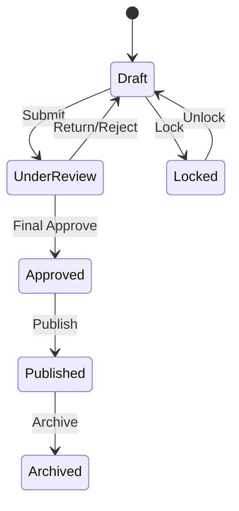

# AI30 Phase 2A — Timetable Lifecycle & Governance

| Field | Value |
|-------|-------|
| **Status** | Implemented |
| **Date** | August 2026 |
| **Migration** | `20260801181017_AI30_Phase2A_TimetableGovernance` |

## Architecture

ScheduleVersion (governance) → Timetable (designer aggregate) → Entries.  
Approvals operate on version/timetable; Publishing sets Timetable.Status=Published; Soft validation is advisory; History is append-only.

## Extension points

Conflict Engine, Optimization, AI Scheduling, Attendance materialization — future phases.

## UI entry

Catalog → Scheduling → Governance *
