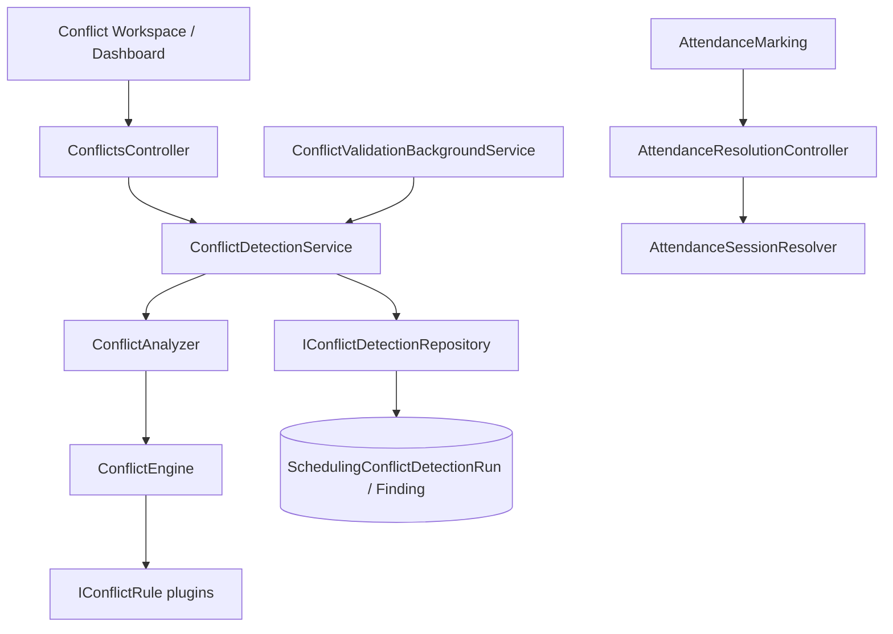

# AI30 Phase 2B — Enterprise Conflict Engine

**Status:** Implemented  
**Scope:** Detect conflicts. Never auto-fix. Never modify timetables. Never generate schedules. No AI / no optimizer.

## Architecture

## Rule engine

- Contract: `IConflictRule` (`RuleCode`, `RuleName`, `Category`, `AnalyzeAsync`)
- Registry: `ConflictRuleRegistration.AddConflictDetection`
- Pipeline: load `ConflictAnalysisContext` → execute all rules → persist `ConflictDetectionRun` + `ConflictFinding`
- Output: explainable `ConflictResult` with recommendation + navigation path

## Conflict categories

| Category | Examples |
|----------|----------|
| Faculty | Double booking, availability, preference, continuous classes, break, cross-campus, lunch, working day |
| Room | Double booking, capacity, feature/type, unavailable, maintenance, lab required |
| Student | Group/semester overlap, duplicate subject, elective/batch/practical/tutorial |
| Calendar | Holiday, working day, semester, academic year, closed campus, holiday types |

## Severity (non-blocking)

`Information` · `Warning` · `Error` · `Critical`

Even **Critical** does not block editing (`ConflictSummary.BlocksEditing = false`).

## Heat maps

Faculty / Room / Department load overlays: Green → Yellow → Orange → Red.

## Attendance resolution

See `AI30_PHASE2B_ATTENDANCE_RESOLUTION.md`.

## Extension points

1. Implement `IConflictRule`
2. Register in `ConflictRuleRegistration`
3. Add unit tests under `Scheduling/Phase2B`

## Future AI integration (Phase 3+)

Optimizer may consume persisted findings as constraints. Phase 2B intentionally does **not** apply fixes.

## ADL references

- Volume 00 Governance / Constitution / ADRs / Principles  
- Volume 03 System Architecture  
- ADR-021 Master Data Ownership (Catalog masters consumed via IDs)  
- AI30 Phase 1–2A.5 foundations + AC1/AC1.5 hardening  
