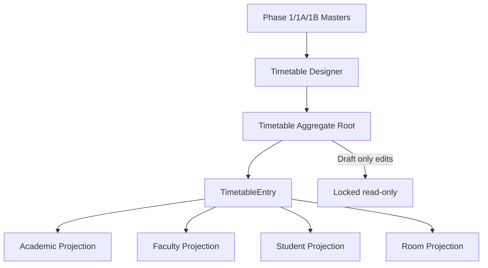

# AI30 Phase 2 — Enterprise Timetable Designer

| Field | Value |
|-------|-------|
| **Document ID** | AI30-Phase2-Enterprise-Timetable-Designer |
| **Status** | Implemented |
| **Date** | August 2026 |
| **Scope** | Manual timetable creation only — no generation, conflict engine, optimizer, AI, or attendance publish |

---

## Architecture

**ADL:** Repository + CQRS-style services, FluentValidation, tenant/soft-delete/audit via `BaseEntity`.  
**ClassSchedule** remains the attendance date bridge — not the designer aggregate.

## Timetable model

| Entity | Role |
|--------|------|
| `Timetable` | Aggregate root: Name, AcademicYear, Department?, TimeSlotSet?, Status (Draft/Locked; Published/Archived reserved) |
| `TimetableEntry` | DayOfWeek + TimeSlot + SubjectAllocation + Room + denormalized Staff/Dept/Course/Group/Semester/Subject |

One source of truth; all views are projections.

## Screen inventory / navigation

Catalog → Scheduling →

| Screen | Path |
|--------|------|
| Timetable list / hub | `/setup/scheduling/timetables` |
| Designer workspace | `/setup/scheduling/timetables/:id` |
| Faculty timetable | `/setup/scheduling/timetable-faculty` |
| Student timetable | `/setup/scheduling/timetable-student` |
| Room timetable | `/setup/scheduling/timetable-room` |
| Timetable dashboard | `/setup/scheduling/timetable-dashboard` |

## Component hierarchy

- `TimetableDesignerPage` → `TimetableGrid` + allocation palette + `TimetableEntryDialog` + `useTimetableHistory`
- Read-only pages → `TimetableGrid` + print/Excel helpers
- Split views: Academic / Faculty / Room filters over the same grid entries
- Multi-cell selection + copy/paste/fill (client) → bulk API

## Reuse analysis

SubjectAllocation, TimeSlot/TimeSlotSet, Room, Staff, AcademicYear, Department, Course, Group, Semester, ClosedXML export.

## Extension points (future)

| Phase | Capability |
|-------|------------|
| Next | Publish / Archive / versioning / approvals |
| Phase 3 | Conflict detection |
| Later | Optimization, AI scheduling, Attendance materialization from Timetable |

## Permissions

`Scheduling.Timetable.View` (36), `Scheduling.Timetable.Manage` (37)

## Migration

`20260801170724_AI30_Phase2_EnterpriseTimetableDesigner`
