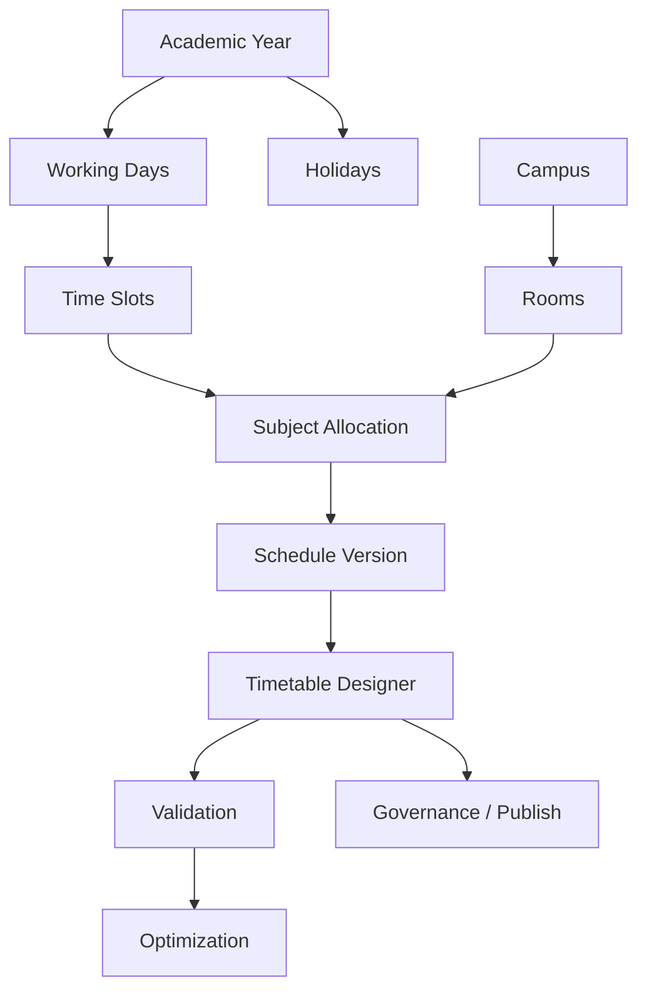

# AI30 Phase 3.5 — Scheduling Experience & Guided Configuration

## Enterprise Setup Guide

Phase 3.5 is an **Enterprise UX enhancement**. It reorganizes the Scheduling Catalog, adds markdown-driven guides, readiness indicators, next-step navigation, and advisory setup validation.

It does **not**:

- Introduce new scheduling engines
- Modify timetable generation
- Modify attendance APIs
- Touch `AttendanceSessionResolver`

## Module Dependency Matrix

| Module | Requires | Used by |
|--------|----------|---------|
| Academic Years | — | Working Days, Holidays, Versions |
| Working Days | Academic Years | Time Slots, Designer |
| Campus | — | Rooms |
| Rooms | Campus | Availability, Rules, Designer |
| Time Slots | Working Days | Subject Allocation, Designer |
| Subject Allocation | Time Slots (+ Catalog Faculty/Subjects/Depts) | Designer, Conflicts, Optimization |
| Schedule Versions | Academic Years | Designer, Publishing |
| Timetable Designer | Allocation, Slots, Rooms, Versions | Governance, Conflicts, Optimization |

## Configuration Flow Diagram

## Minimum Configuration Guide

1. Academic Year  
2. Working Days  
3. Campus  
4. Rooms  
5. Time Slots  
6. Faculty (Catalog)  
7. Subject Allocation  
8. Schedule Version  
9. Timetable Designer  
10. Publish  

Use UI: `/setup/scheduling/quick-start`

## FAQ

**Q: Do faculty without timetables break?**  
A: No. They continue Course → Group → Semester → Subject → Period → Attendance via `AttendanceSessionResolver`.

**Q: Does readiness block publishing?**  
A: No. Setup validation never blocks; conflict detection is separate.

**Q: Where is the Configuration Guide?**  
A: Beside Scheduling on Catalog, and `/setup/scheduling/configuration-guide` (markdown + PDF print).

## Administrator Handbook

- Prefer Catalog Departments SSOT (AC1).  
- Complete required modules before designer.  
- Use hub status chips + next recommended step.  
- Open module Help for Requires / Used By / Related.

## Architecture Review

See `AI30_PHASE35_ARCHITECTURE_REVIEW.md`.

## Implementation Summary

See `AI30_PHASE35_IMPLEMENTATION_SUMMARY.md`.
