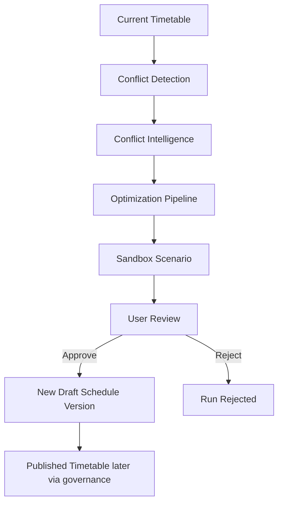
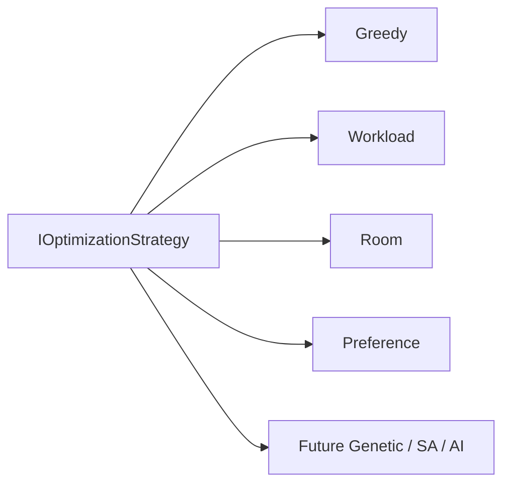
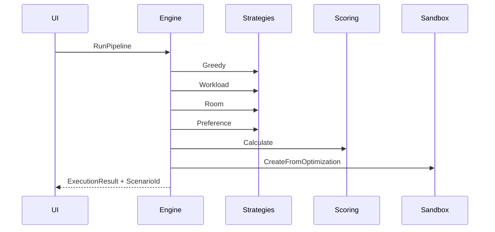

# AI30 Phase 3 — Enterprise Timetable Optimization Engine

## Architecture Review

Phase 3 replaces “AI generates timetable” with a human-controlled optimization loop:

```
Current Timetable
    → Conflict Engine
    → Conflict Intelligence (advisory)
    → Optimization Engine (pluggable strategies)
    → Optimization Sandbox
    → User Reviews
    → Apply Approved Changes
    → New Draft Timetable Version
    → (later) Published Timetable
```

**Hard rules**

- Optimization never edits production / published timetables.
- Optimization never overwrites an existing draft.
- Optimization always produces a Sandbox Scenario.
- Approval always creates a **new** Draft schedule version.
- Attendance APIs are unchanged. `AttendanceSessionResolver` remains the only mode switch between Legacy and Timetable attendance.

## Implementation Summary

| Prompt | Deliverable |
|--------|-------------|
| 3.1 | `OptimizationEngine`, `OptimizationExecutionService`, context/result/progress/session |
| 3.2 | `GreedyOptimizationStrategy` |
| 3.3 | `FacultyWorkloadOptimizationStrategy` |
| 3.4 | `RoomOptimizationStrategy` |
| 3.5 | `PreferenceOptimizationStrategy` |
| 3.6 | `OptimizationPipeline` (Greedy→Workload→Room→Preference→Scoring→Sandbox) |
| 3.7 | SignalR progress (`/hubs/optimization`) |
| 3.8 | Original vs optimized comparison |
| 3.9 | Approval → new draft version |
| 3.10 | Optimization Dashboard UI |
| 3.11 | Unit tests |
| 3.12 | This documentation |

Scoring reuses Phase 2B.6 `OptimizationScoreCalculator`. Strategies do not invent scoring.

## Optimization Flow Diagram



## Strategy Diagram



## Pipeline Diagram



## Sandbox Integration

`OptimizationExecutionService` persists `OptimizationEngineRun` and calls `ISandboxService.CreateFromOptimizationAsync` with candidates, comparison, and intermediate results. Snapshots remain immutable after Save (Phase 2B.7 rules).

## Attendance Compatibility

| Mode | Path |
|------|------|
| Legacy | Faculty → Course → Group → Semester → Subject → Period → Attendance |
| Timetable | Faculty → Today’s Timetable → Attendance |

No attendance controllers/APIs/workflows were modified in Phase 3.

## Migration Guide

1. Apply EF migration `AI30_Phase3_EnterpriseOptimizationEngine` (table `SchedulingOptimizationEngineRun`).
2. Deploy API + UI.
3. Open **Scheduling → Optimization dashboard**.
4. Run pipeline → review sandbox → Approve → verify a **new Draft** schedule version is created.
5. Confirm published timetable and existing drafts are unchanged.
6. Confirm faculty without timetable still use legacy attendance.

## Explicit Non-Scope

OpenAI/LLM scheduling, genetic algorithms, simulated annealing, reinforcement learning, automatic publishing, automatic approval, automatic attendance creation.
