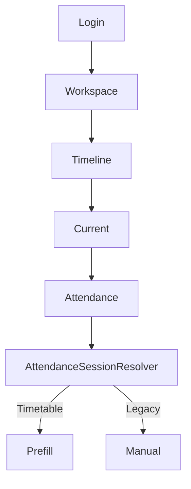
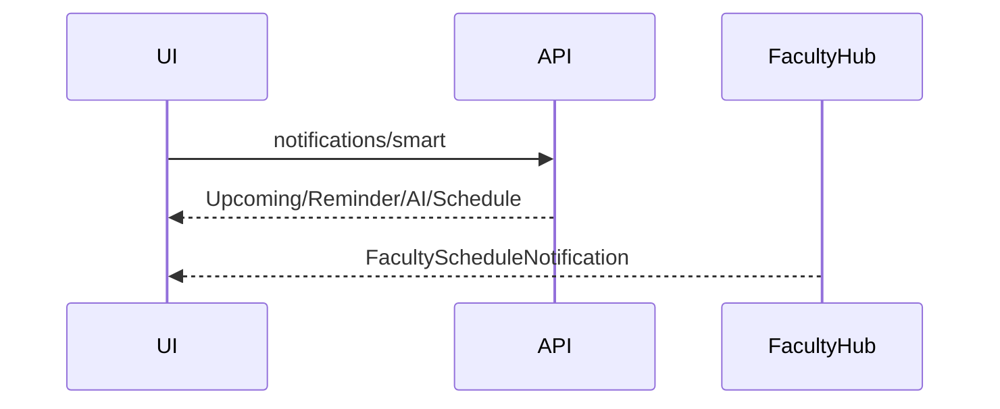

# AI31.5 — Enterprise Faculty Enhancements

## Architecture Review

Faculty Workspace remains a **composition layer**:

```
Faculty Workspace
  ├── Scheduling (reuse)
  ├── Attendance (reuse APIs)
  ├── AI Attendance (reuse AI22)
  ├── Notifications (reuse SignalR)
  ├── Analytics (reuse rollups)
  └── Preferences (per-faculty)
```

`AttendanceSessionResolver` is unchanged and remains the only Timetable vs Legacy decision point.

## Implementation Summary

| Prompt | Deliverable |
|--------|-------------|
| 31.5.1 | ICS export + subscribe feed + calendar docs |
| 31.5.2 | Daily timeline (classes/breaks/status) |
| 31.5.3 | Classroom navigation (campus/building/floor/room) |
| 31.5.4 | `WorkspacePreference` + service/DTO |
| 31.5.5 | Attendance productivity |
| 31.5.6 | Productivity dashboard (Recharts) |
| 31.5.7 | Smart notifications (SignalR, no polling) |
| 31.5.8 | Enterprise search (EF Contains, no ES) |
| 31.5.9 | Lazy charts, skeletons, a11y/ARIA/high contrast |
| 31.5.10 | Swipe timeline, sticky/one-handed, tablet layout |
| 31.5.11 | Unit tests |
| 31.5.12 | This documentation pack |

## Faculty Journey



## Timeline Flow

Today schedule → ordered classes → insert breaks → annotate attendance/AI review → swipe focus on mobile.

## Workspace Diagram

`/faculty` tabs: Today · Timeline · Current · Timetable · Calendar · Productivity · Search · Room · Preferences · Insights · Notifications

## Notification Flow



## Preference Model

Per `TenantId + StaffId` row in `SchedulingWorkspacePreference` (auditable BaseEntity). Never global.

## Accessibility Report

- Landmark `main` + ARIA labels on tabs/search/charts/timeline
- Keyboard-focusable actions (MUI buttons/fields)
- High-contrast preference mode
- Screen-reader live regions for smart notifications / swipe focus
- Large touch targets / one-handed mode

## Performance Report

- Productivity charts lazy-loaded (`React.lazy`)
- Skeletons while loading enhancement panels
- Preference/reference data loaded once
- Services compose `IFacultyDashboardService` (no parallel timetable engine)
- Search uses existing EF indexes/fields (no Elasticsearch)

## Migration Guide

1. Apply EF migration `AI31_5_WorkspacePreference` (table `SchedulingWorkspacePreference`).
2. Deploy API + UI.
3. Faculty opens `/faculty` → Preferences → save landing/theme.
4. Verify calendar ICS export and subscribe URL.
5. Verify AttendanceSessionResolver Timetable + Legacy still work.

## Deployment Checklist

- [ ] Migration applied
- [ ] `/api/faculty/workspace/*` enhancement routes live
- [ ] SignalR `/hubs/faculty` unchanged/compatible
- [ ] UI tabs render on phone/tablet/desktop
- [ ] Attendance APIs unchanged smoke test
- [ ] Unit tests pass
- [ ] Desktop/CursonModifiedFiles copy completed

## Test Report

`AI315FacultyEnhancementTests` — calendar, timeline, preferences, navigation, productivity, notifications, search, accessibility flags, attendance compatibility.
