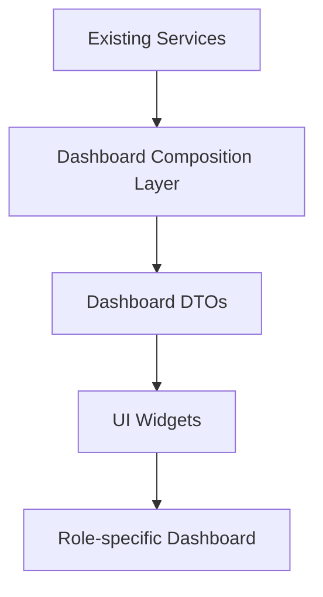
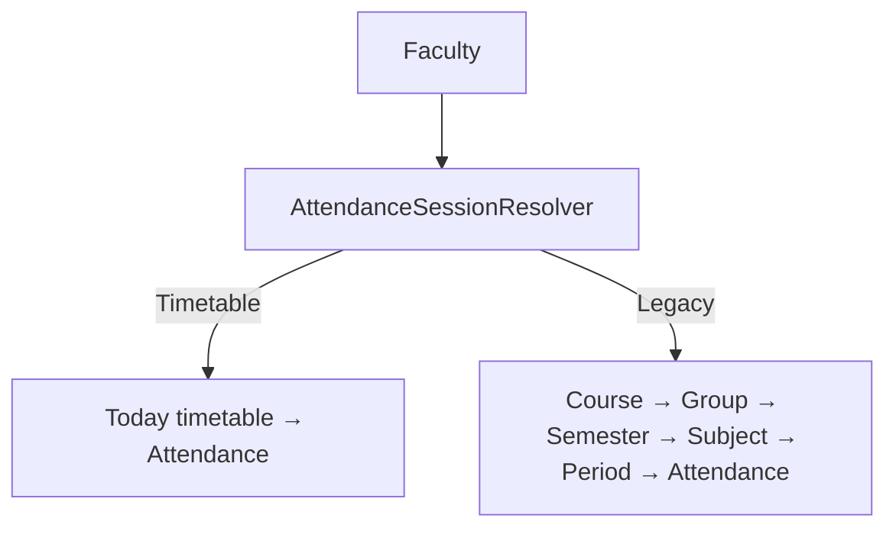

# AI31.6 — Enterprise Dashboards & Operational Intelligence

## Faculty Dashboard Guide

`/dashboard` (Faculty) and `/dashboard/faculty` open the **Faculty Command Center**:

- Today's Classes / Current / Next / Remaining / Students / Pending / Recovery
- KPI widgets (reusable)
- Insights panel (composed, never generative AI)
- Activity timeline (Today / Week / Month)
- Quick actions → Attendance, Workspace, Recovery, Reports, Timetable

**Faculty Workspace** at `/faculty` is preserved.

## Admin Dashboard Guide

`/dashboard` (Admin) and `/dashboard/admin` open the **Enterprise Operations Dashboard** with sections:

Academic · Attendance · Scheduling · Faculty · Student · Recovery · AI Services · Platform Health

Each section includes cards, Recharts (where applicable), and quick links.

## Operational Intelligence Guide

- Widgets: `DashboardWidgetCatalog` + `DashboardWidgetGrid`
- Analytics: `/dashboard/analytics` → Excel (CSV) / PDF export
- Health: `/dashboard/health` traffic lights
- Notifications: `/dashboard/notifications` (SignalR, no polling)
- Preferences: `/dashboard/preferences` (DB persisted)

## Notification Center Guide

Sources composed: Scheduling, Attendance, Recovery, System.  
User state: unread / pin / dismiss / archive. Live updates via `FacultyHub`.

## Dashboard Architecture



## Widget Architecture

```
DashboardWidget
  ├── KPI Widget
  ├── Chart Widget
  ├── Timeline Widget
  ├── Notification Widget
  ├── Action Widget
  └── Status Widget
```

Prepared for Faculty, Academic Admin, Principal, College Admin, Super Admin, Student (AI32), Parent (future).

## Attendance Modes (unchanged)



## API Surface

`GET/PUT api/enterprise-dashboards/*` — composition only. No Attendance / Timetable / Scheduling engine changes.
