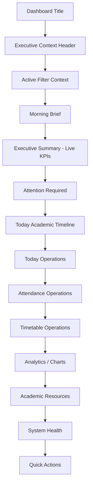

# AI31.8.2 — Executive Dashboard Information Architecture

## Objective

Separate **context**, **operational KPIs**, and **actionable intelligence** on the Administration Enterprise Operations Command Center.

This release is **presentation/composition only**. No attendance, scheduling, optimization, AI recognition, recovery, or `AttendanceSessionResolver` changes.

## Information Architecture

## Layers

| Layer | Purpose | Contents |
|-------|---------|----------|
| Context | Who / when / filters | College, Academic Year, Date, Time, Campus/Dept filters |
| Narrative | At-a-glance story | Morning Brief (rule-composed, no AI) |
| Status | Current operational state | 8 live Executive KPIs |
| Action | What needs attention | Attention Required cards |
| Now | Live day operations | Timeline + Today / Attendance / Timetable |
| History | Trends | Analytics visualizations |
| Support | Resources & health | Academic Resources, System Health |
| Do | Next steps | Quick Actions |

## Composition Approach

Client-side composition in `executiveInformationArchitecture.ts` remaps existing excellence + command-center DTO fields into operational executive KPIs and the Morning Brief. **No new APIs.**

## Attendance Compatibility

- Faculty without timetable: Course → Group → Semester → Subject → Period — unchanged
- Faculty with timetable: Today's Timetable → Attendance — unchanged
- `AttendanceSessionResolver` remains the only mode selector — not modified
