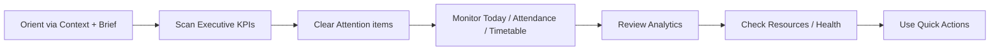

# AI31.8.2 — Operational Focus Validation

## Section → Question mapping

| Section | Question answered | Validation |
|---------|-------------------|------------|
| Executive Context | Who am I operating for, and under what filters? | Pass — College, Year, Date, Time, Campus/Dept |
| Morning Brief | What should I know first this morning? | Pass — rule-composed narrative from live metrics |
| Executive Summary | What is the current operational status? | Pass — 8 live operational KPIs only |
| Attention Required | What requires action? | Pass — severity-sorted actionable cards |
| Today's Academic Timeline | Where are we in today's academic day? | Pass — horizontal ops + period chips |
| Today's Operations | What is happening now? | Pass — running classes, faculty teaching, remaining |
| Attendance Operations | How is attendance progressing? | Pass — running → recognition → review → recovery → completed |
| Timetable Operations | What is the scheduling status? | Pass — versions, approvals, conflicts, optimization |
| Analytics | What do historical trends show? | Pass — moved below operations |
| Academic Resources | What academic resources are available? | Pass — catalog/resource KPIs |
| System Health | Is the platform healthy? | Pass — component health |
| Quick Actions | What can I do next? | Pass — permission-aware grouped tiles |

## Operator flow

## Result

Every primary section answers exactly one operator question. Historical analytics no longer compete with live operational focus in the first viewport.
