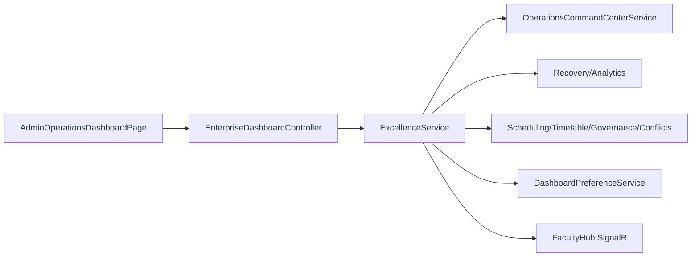
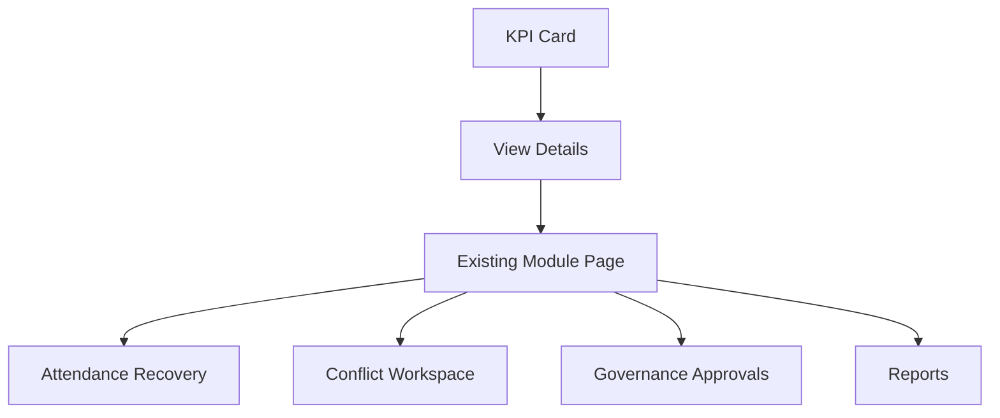
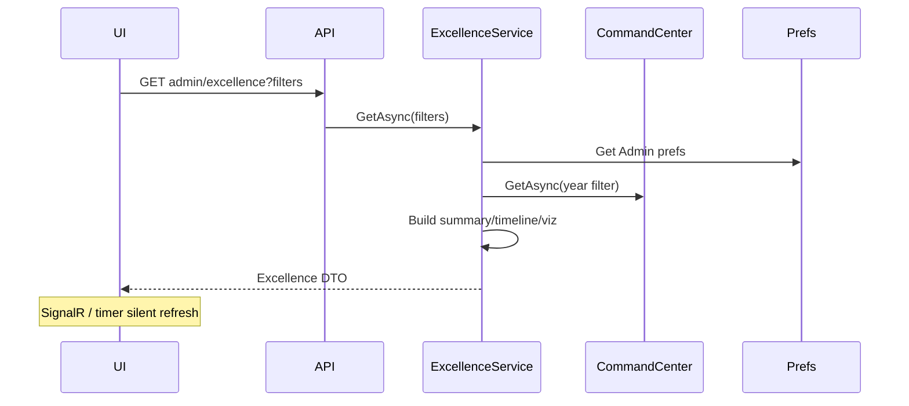

# AI31.8 — Enterprise Operations Dashboard Excellence

## Architecture Review

AI31.8 is a **presentation, usability, and operational intelligence** release on top of AI31.6 / AI31.7 / AI31.7.5.

| Concern | Decision |
|---------|----------|
| Composition | `EnterpriseDashboardExcellenceService` wraps Command Center + analytics + scheduling signals |
| Personalization | Extends existing `DashboardPreference` (per Tenant + User + RoleScope) |
| Filters | `DashboardFilterRequest` persisted; Academic Year passed into timetable/governance/conflicts |
| Live updates | Configurable polling + FacultyHub SignalR nudge |
| Export | ClosedXML Excel + CSV snapshot + text executive report + browser print |
| Out of scope | AttendanceSessionResolver, Attendance APIs, Scheduling/Timetable/Governance/Conflict/Optimization engines, Faculty Workspace redesign |

ADL Volumes 00–12 were **not present in-repo**; implementation followed in-repo AI22 / AI30 / AI31 docs and the stated constraints.

## Implementation Summary

| Prompt | Deliverable |
|--------|-------------|
| 8.1 | Executive Summary header (large KPI cards) |
| 8.2 | Responsive 1–4 column density (≤2560) |
| 8.3 | Global Academic Year / Department / Course / Campus / Building / Room filters |
| 8.4 | Pin / hide / reorder / restore defaults (DB prefs) |
| 8.5 | Intelligent KPI cards (value + unit + explanation + trend + updated) |
| 8.6 | Today's Academic Timeline (read-only) |
| 8.7 | Drill-down with filter query string |
| 8.8 | Recharts heatmaps / trends |
| 8.9 | Widget Help Drawer |
| 8.10 | Grouped executive actions |
| 8.11 | WCAG: ARIA, focus, larger targets, high-contrast pref |
| 8.12 | Refresh 30s/1m/2m/5m/manual + pause + SignalR |
| 8.13 | Print / Excel / CSV / executive report |
| 8.14 | Sequential composition, silent refresh, cancellation-friendly API |
| 8.15 | Unit tests (`AI31_8_EnterpriseDashboardExcellenceTests`) |
| 8.16 | This documentation pack |

## Dashboard Layout Guide

1. Toolbar (refresh / export / preferences)  
2. Global filters  
3. Executive Summary  
4. Action banners  
5. Academic Timeline  
6. Command Center sections (Attention → … → Health)  
7. Visualizations  
8. Action groups  

## Widget Guide

Widgets reuse `DashboardWidgetDto` with AI31.8 fields: `Explanation`, `Pinned`, `Unit`, `Comparison`, `StatusLabel`, `ReportPath`.

## Personalization Guide

`DashboardPreferences` columns:

- `PinnedWidgetsJson`, `FilterJson`, `RefreshIntervalSeconds`, `HighContrast`
- Existing: `HiddenWidgetsJson`, `WidgetOrderJson`, `CompactMode`, `DefaultLandingPage`

Apply SQL: `scripts/Apply_AI31_8_DashboardExcellenceSchema.sql`.

## Performance Guide

- Target initial load &lt; 2s under normal ops (composition of existing cached/read endpoints)
- Silent refresh; SignalR reduces unnecessary polls when events fire
- Sequential DbContext access (no parallel EF on scoped context)

## Accessibility Guide

- Accordion `aria-controls` / header ids  
- KPI `role="link"`, `tabIndex`, `aria-label`  
- Help drawer dialog labeling  
- Min 36–40px click targets on icon/action buttons  
- Optional high-contrast preference  

## Responsive Guide

| Width | Columns |
|-------|---------|
| Tablet / mobile | 1–2 |
| ~1200 | 2–3 |
| ~1600 | 3 |
| 1920+ | 4 |

## Deployment Guide

1. Deploy API + UI  
2. Run `Apply_AI31_8_DashboardExcellenceSchema.sql` (idempotent)  
3. Admin opens `/dashboard` → excellence endpoint `GET /api/enterprise-dashboards/admin/excellence`  

## Migration Guide

- Additive preference columns only  
- Legacy `admin/command-center` retained with filter query params  
- Collapse localStorage key moved to `ai31.8.*` (non-breaking)

## Attendance Compatibility

| Mode | Status |
|------|--------|
| Legacy Course→…→Period | Unchanged |
| Timetable → Attendance | Unchanged |
| AttendanceSessionResolver | **Not modified** |

## Diagrams

### Dependency

### Navigation

### Data Flow

