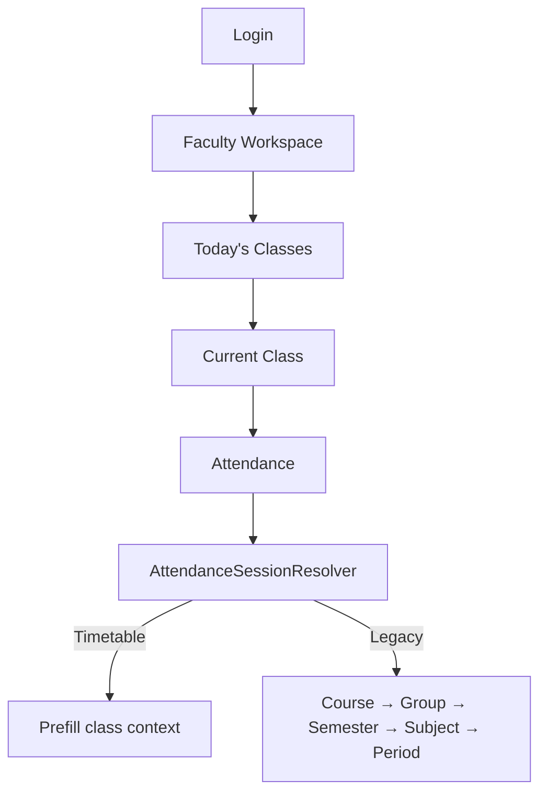
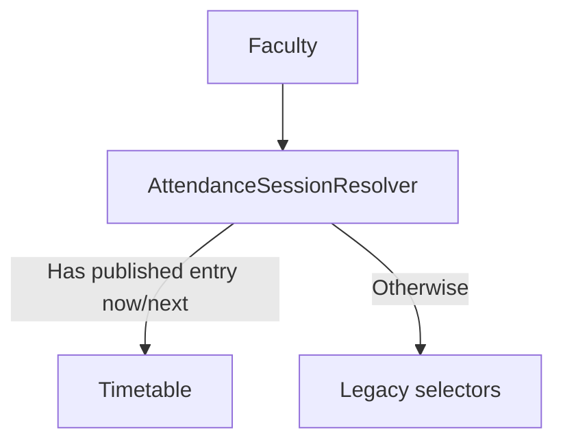

# AI31 — Intelligent Faculty Experience Platform

## Architecture Review

AI31 delivers the faculty **daily operational home screen**. It aggregates existing Scheduling and Attendance surfaces; it does **not** duplicate timetable engines, attendance APIs, or AI22 recognition pages.

| Rule | Status |
|------|--------|
| Attendance APIs unchanged | Pass |
| `AttendanceSessionResolver` sole mode switch | Pass |
| Reuse scheduling / AI22 / SignalR | Pass |
| No student/parent/LMS features | Pass |
| Offline = status only | Pass |

## Implementation Summary

| Prompt | Deliverable |
|--------|-------------|
| 31.1 | `FacultyWorkspacePage`, `FacultyDashboardService`, `FacultyTodayDto` |
| 31.2 | Current class workspace API + UI tab |
| 31.3 | One-click attendance → `/attendance` (resolver pre-fills) |
| 31.4 | AI attendance contextual launch (`?ai=1` / existing panel) |
| 31.5 | Faculty timetable Today/Week/Month/Agenda |
| 31.6 | Schedule notifications + SignalR `/hubs/faculty` |
| 31.7 | Insights (session rollups) |
| 31.8 | Quick action bar |
| 31.9 | AI22.7C responsive/safe-area/sticky actions |
| 31.10 | Offline awareness banner |
| 31.11 | Unit tests |
| 31.12 | This documentation |

## Faculty Journey



## Navigation Diagram

```
/faculty (home)
  ├─ Today
  ├─ Current class
  ├─ Timetable
  ├─ Insights
  └─ Notifications
/attendance          (existing)
/attendance/sessions/:id/review  (AI22 reuse)
```

## Attendance Resolution Diagram



## Mobile Diagram

```
Phone/Tablet/Desktop
  └─ same FacultyWorkspacePage
       ├─ safe-area insets
       ├─ large touch targets
       └─ sticky quick actions (phone)
```

## Migration Guide

1. Deploy API + UI (no EF migration required for AI31 core).
2. Ensure faculty users have `StaffId` claim + `Attendance.Manage`.
3. Faculty login lands on `/faculty`.
4. Verify timetable faculty see current class; others keep manual attendance.

## Deployment Checklist

- [ ] API exposes `GET /api/faculty/workspace/*`
- [ ] SignalR hub `/hubs/faculty` mapped + CORS
- [ ] UI route `/faculty` protected by Attendance.Manage
- [ ] Login redirect for staff → `/faculty`
- [ ] Attendance APIs unchanged smoke test
- [ ] Offline banner shows when network drops
- [ ] Unit tests `AI31FacultyWorkspaceTests` pass
