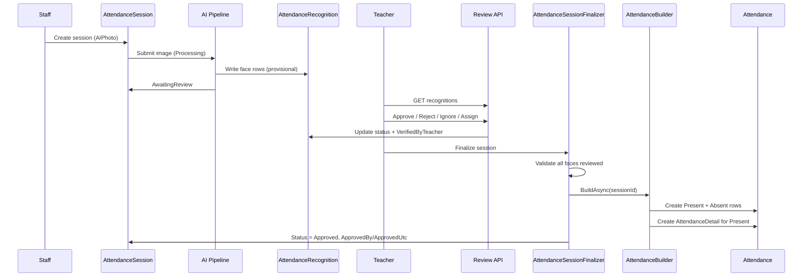

# AI Attendance — Recognition Review Workflow

This document describes the **Recognition Review** workflow in Abhyanvaya: how AI face-matching results become official college attendance, why teacher review is mandatory, and how session approval is gated on successful attendance materialization.

It applies to **AI Photo** attendance (`AttendanceMethod.AIPhoto`) and is designed to coexist with legacy **manual** attendance without changing existing manual APIs or reports semantics.

---

## 1. Architectural principle: two layers of truth

Abhyanvaya deliberately separates **provisional AI output** from **authoritative college records**.

| Layer | Entity | Role |
|-------|--------|------|
| **AI output (provisional)** | `AttendanceRecognition` | One row per detected face. Stores match scores, bounding boxes, and review state. **Not** used for reports, transcripts, or compliance. |
| **Official college data** | `Attendance` (+ `AttendanceDetail`) | One row per student per subject per date. Used by dashboards, reports, locking, and all existing attendance features. |

```
AttendanceSession (workflow parent)
├── AttendanceRecognition[]   ← AI pipeline writes here
└── Attendance[]              ← created only after teacher review + finalization
        └── AttendanceDetail  ← capture metadata (recognition link, confidence, method)
```

**Key rule:** No `Attendance` row is created from AI results until a teacher completes review and the session is finalized.

---

## 2. Entity responsibilities

### 2.1 `AttendanceSession`

Represents one attendance-taking event (manual, AI photo, QR, RFID, biometric, etc.).

- Holds academic context: course, group, semester, subject, date, period.
- Holds capture metadata: uploaded image keys, dimensions, recognition provider/model.
- Tracks workflow via `AttendanceSessionStatus`.
- Records **who initiated** the session (`StaffId`) and **who approved** it (`ApprovedBy`, `ApprovedUtc`).

**Session status lifecycle (AI photo path):**

```
Draft → Pending → Processing → AwaitingReview → Approved
                              ↘ Failed
                              ↘ Cancelled (voided; no official attendance)
```

| Status | Meaning |
|--------|---------|
| `Draft` | Session created; not yet submitted. |
| `Pending` | Queued for AI processing or faculty action. |
| `Processing` | AI pipeline running. |
| `AwaitingReview` | AI finished; teacher must review recognitions. |
| `Approved` | Review complete; `Attendance` rows materialized; session is authoritative. |
| `Failed` | Processing or validation error (`ProcessingError`). |
| `Cancelled` | Session voided for audit; no finalization. |

### 2.2 `AttendanceRecognition` — AI output only

Each row is **one detected face** in a session image.

| Field group | Purpose |
|-------------|---------|
| Match outcome | `RecognitionStatus`, `ConfidenceScore`, `EmbeddingDistance`, `StudentId` |
| Geometry | `BoundingBoxX/Y/Width/Height`, `FaceNumber` |
| Teacher review | `VerifiedByTeacher`, `TeacherOverride`, `ReviewNotes` |
| Audit | `CreatedUtc`, `RowVersion` (optimistic concurrency) |

**`RecognitionStatus` (persisted AI/review outcome):**

| Value | Meaning |
|-------|---------|
| `Unknown` | Face detected; no conclusive match. |
| `Recognized` | AI matched a student above threshold. |
| `LowConfidence` | Match below threshold — requires teacher decision. |
| `Duplicate` | Same student matched more than once in the image. |
| `Ignored` | Excluded (staff, visitor, background). |
| `Rejected` | Match rejected by rules or teacher. |
| `ManuallyAssigned` | Teacher assigned or corrected the student. |

**`RecognitionReviewAction` (teacher command from UI/API):**

| Action | Typical effect |
|--------|----------------|
| `Approve` | Confirm match → `Recognized`, `VerifiedByTeacher = true` |
| `Reject` | → `Rejected`, verified |
| `Ignore` | → `Ignored`, student cleared, verified |
| `AssignStudent` | → `ManuallyAssigned`, `TeacherOverride = true`, verified |
| `Reset` | Clears review; restores row for re-review |

Teacher commands are **distinct** from `RecognitionStatus`: services map actions to persisted status updates.

### 2.3 `Attendance` — official college data

Existing tenant-scoped entity used across the ERP.

- Unique constraint: `(TenantId, StudentId, SubjectId, Date)`.
- Optional `AttendanceSessionId` links AI-generated rows to their parent session (manual rows may remain `NULL`).
- `Status`: `Present` or `Absent`.
- `IsLocked`: prevents modification after lock (honored by `AttendanceBuilder`).

### 2.4 `AttendanceDetail` — capture metadata

One-to-one extension of `Attendance` for session-based capture.

- Links to source `AttendanceRecognitionId` when present.
- Stores `CaptureMethod`, `ConfidenceScore`, `TeacherOverride`, `FaceNumber`.
- Supports audit and future reporting without overloading `Attendance`.

---

## 3. Teacher review is mandatory

AI face matching is **assistive**, not authoritative. A teacher (or authorized staff with `CanManageAttendance`) must:

1. Review every detected face in the session.
2. Resolve **Unknown** and **LowConfidence** faces (approve, reject, ignore, or assign).
3. Confirm or correct AI-assigned students.
4. Explicitly **finalize** the session when satisfied.

**Finalization gate (`AttendanceSessionFinalizer`):**

Before `AttendanceBuilder` runs, the finalizer rejects the session if:

- Any recognition has `RecognitionStatus = Unknown`
- Any recognition has `RecognitionStatus = LowConfidence`
- Any recognition has `VerifiedByTeacher = false` (pending review)

This ensures no official attendance is written from unreviewed AI output.

**Review UI:** `/attendance/sessions/{sessionId}/review` — classroom photo with bounding boxes, per-face actions, batch approve/reject, and finalize.

---

## 4. End-to-end workflow



### Phase A — Session creation and AI processing

1. Staff initiates an `AttendanceSession` with `AttendanceMethod.AIPhoto`.
2. Classroom photo is stored (`OriginalImageKey`, optional `AnnotatedImageKey`).
3. Session moves through `Pending` → `Processing`.
4. AI pipeline writes one `AttendanceRecognition` row per detected face.
5. Session becomes `AwaitingReview`.

*AI pipeline implementation is out of scope for this document; the domain model and review APIs are ready to consume its output.*

### Phase B — Teacher recognition review

Teacher uses the Recognition Review page or REST APIs:

| Method | Endpoint | Purpose |
|--------|----------|---------|
| GET | `/api/attendance-sessions/{id}` | Session context and image URLs |
| GET | `/api/attendance-sessions/{id}/recognitions` | All faces for review |
| POST | `/api/attendance-recognition/review` | Single-face action |
| POST | `/api/attendance-recognition/review-batch` | Batch approve/reject |
| DELETE | `/api/attendance-recognition/{id}/reset` | Clear review on one face |

Authorization: **`CanManageAttendance`** (Admin or Faculty, tenant-scoped).

### Phase C — Finalization and attendance materialization

Teacher triggers **Finalize attendance**:

| Method | Endpoint | Purpose |
|--------|----------|---------|
| POST | `/api/attendance-sessions/{id}/finalize` | Validate, build, approve |

**Order of operations (critical):**

1. `AttendanceSessionFinalizer` validates all recognitions are reviewed.
2. **`AttendanceBuilder.BuildAsync`** runs (session is **not** approved yet).
3. On success, session is updated: `Status = Approved`, `ApprovedUtc`, `ApprovedBy`, `CompletedUtc`.
4. Summary returned: Present, Absent, Ignored, Rejected, Unknown counts.

**`AttendanceSession` is approved only after `AttendanceBuilder` completes successfully.** If building fails (e.g. locked attendance, duplicate constraint), the session remains unapproved and no partial approval is recorded.

---

## 5. `AttendanceBuilder` — reviewed recognitions → official attendance

`IAttendanceBuilder.BuildAsync(AttendanceSessionId)`:

### Input selection (Present)

Includes `AttendanceRecognition` rows where **all** of:

- `VerifiedByTeacher == true`
- `RecognitionStatus` is `Recognized` **or** `ManuallyAssigned`
- `StudentId` is not null
- Student is in the enrolled roster for the session subject (course/group/semester, language cohort, or elective mapping)

Dedupes by `StudentId` (lowest `FaceNumber` wins if multiple faces map to the same student).

### Generated rows

| Output | Rule |
|--------|------|
| `Attendance` (Present) | One per verified present student not already on file for that subject/date |
| `AttendanceDetail` | One per new Present row — links recognition, confidence, capture method |
| `Attendance` (Absent) | Enrolled students without a Present match and no existing row |

### Safeguards

- **No duplicates:** skips insert when `(TenantId, StudentId, SubjectId, Date)` already exists (manual or prior session).
- **Locked attendance:** aborts if subject/date is locked.
- **Does not approve session:** builder only writes attendance; approval is the finalizer’s responsibility after build succeeds.
- **Idempotent:** re-running on an already-built session creates no duplicate rows.

---

## 6. Data boundaries and backward compatibility

| Concern | Design choice |
|---------|---------------|
| Manual attendance | Unchanged APIs; `AttendanceSessionId` nullable on manual rows |
| Reports / dashboard | Continue to query `Attendance` only |
| AI results | Never queried for official percentages |
| Tenant isolation | `AttendanceSession`, `AttendanceRecognition` implement `ITenantScoped`; global query filters apply |
| Soft delete | Sessions use `Cancelled` status, not `IsDeleted` |

---

## 7. Future support (planned extensions)

The current schema and service boundaries are intentionally extensible. The following are **not implemented** in this release but are anticipated in domain comments and architecture.

### 7.1 Multiple AI providers

- Provider identity lives on `AttendanceSession`: `RecognitionProvider`, `RecognitionModel`.
- Each recognition row is provider-agnostic; provider-specific fields can be added later or routed through a provider registry.
- `AttendanceBuilder` and review workflow remain unchanged — they consume reviewed recognitions regardless of provider.

### 7.2 Multiple classroom photos

- Today: one primary image per session (`OriginalImageKey`, `AnnotatedImageKey`, `ThumbnailImageKey`).
- Future: multiple images per session, each producing recognitions keyed by `(AttendanceSessionId, FaceNumber)` with optional `PhotoIndex` or child `AttendanceSessionPhoto` entity.
- Review UI would group or tab by photo; finalization would still require all faces across all photos to be reviewed.

### 7.3 Video recognition

- Future: session captures video stream or clip instead of (or in addition to) a still photo.
- Recognitions would reference frame timestamp and optional clip segment; bounding boxes may be per-frame.
- `AttendanceSession` may gain `MediaType`, duration, and frame-rate metadata.
- Review workflow unchanged in principle: provisional recognitions → teacher review → builder → approval.

### 7.4 Attendance audit

- Today: `CreatedUtc`, `ReviewNotes`, `VerifiedByTeacher`, `TeacherOverride`, `ApprovedBy` / `ApprovedUtc` on session; `AttendanceDetail` links recognition to official row.
- Future: dedicated **audit history** entity (before/after snapshots for recognition and attendance changes), immutable event log, and export for compliance.
- Session voiding via `Cancelled` preserves rows for historical reporting without deleting audit trail.

---

## 8. Service and API map (reference)

| Component | Responsibility |
|-----------|----------------|
| `AttendanceRecognitionReviewService` | Load recognitions; apply teacher review actions |
| `AttendanceBuilder` | Materialize `Attendance` + `AttendanceDetail` from reviewed recognitions |
| `AttendanceSessionFinalizer` | Validate review completeness → call builder → approve session |
| `AttendanceRecognitionController` | REST: list, review, batch, reset |
| `AttendanceSessionController` | REST: session context, finalize |
| Recognition Review UI | `AttendanceRecognitionReviewPage` at `/attendance/sessions/:sessionId/review` |

---

## 9. Summary

| Statement | True in Abhyanvaya |
|-----------|-------------------|
| `AttendanceRecognition` is AI output | Yes — provisional, per-face, not official attendance |
| `Attendance` is official college data | Yes — used by all existing attendance features |
| Teacher review is mandatory | Yes — finalization blocked until every face is verified |
| `AttendanceBuilder` converts reviewed recognitions | Yes — Present + Absent + `AttendanceDetail` for Present |
| Session approved only after builder completes | Yes — `Approved` set by finalizer **after** successful `BuildAsync` |

---

*Document version: Recognition Review workflow (Phase A2). Aligns with domain entities, application services, REST API, and React review page as implemented in the Abhyanvaya repository.*
